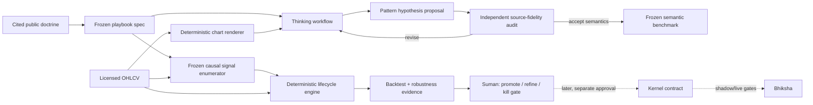

# Classical Pattern Lab — Vision, Architecture, and Delivery PRD

Status: Mala rectangle v1 semantics frozen; Public frozen-cohort validation implementation ready
Owner: Suman + Codex
Last Updated: 2026-07-17
Target Release: Research iteration 1; no runtime release
Canonical home: `mala_v2`
Source-control state: local `main`; do not publish to the current public Mala origin

Sources:

- [Mala Vision v2.2](MALA_VISION_v2.2.md)
- [Mala Playbook Consultation Layer](PLAYBOOK_CONSULTATION_LAYER.md)
- [Mala Playbook Promotion Gates](PLAYBOOK_AUTOMATION_GATES.md)
- [TechCharts: A Framework for Classifying Chart Pattern Breakouts](https://blog.techcharts.net/2026/07/14/a-framework-for-classifying-chart-pattern-breakouts/)
- [Peter Brandt: About](https://www.peterlbrandt.com/about-us/)
- [Peter Brandt: The Four Key Pillars of Factor](https://www.peterlbrandt.com/knowledge-center/four-key-pillars-factor/)
- [Peter Brandt: July Soybeans — A Chart Lesson](https://www.peterlbrandt.com/july-soybeans-a-chart-lesson/)
- [TradingView Terms of Use](https://www.tradingview.com/policies/)
- [tradesdontlie/tradingview-mcp](https://github.com/tradesdontlie/tradingview-mcp)
- [Classical Rectangle Public Validation Protocol](CLASSICAL_PATTERN_PUBLIC_VALIDATION.md)

## Executive Summary

Build a **Classical Pattern Lab inside Mala v2** that turns one precisely scoped
Peter Brandt-inspired chart-pattern method at a time into a reviewable,
deterministic research program. A chart-reasoning agent proposes pattern type,
anchors, boundaries, and ambiguity from an as-of chart. Independent
outcome-blind reviewers audit the proposal against a frozen rubric derived
from cited public sources. Mala derives breakout, Last Full Day, negation, and
objective from those anchors plus the frozen rule, then deterministically
simulates entries, stops, exits, costs, re-entry variants, and portfolio
results. Suman governs whether the research continues or is eventually
promoted; he is not required to act as a Peter-style chart curator.

This is structurally similar to Mala's existing Flywheel process, but the human
review question changes. The Flywheel asks whether the machine represents
Suman's own trade. This lane asks whether the machine represents a frozen
classical-pattern doctrine faithfully enough to test. Human judgment calibrates
semantic fidelity; it must not select winners after seeing returns.

The first recommended slice is a **daily horizontal rectangle breakout** with a
close-confirmed entry, Last Full Day initial stop, explicit structural negation,
and measured objective. It is intentionally narrower than "trade like Peter
Brandt." The goal is to discover whether a reproducible subset of the method
has an edge after realistic frictions—not to imitate a person or claim that
all of Brandt's discretionary judgment has been captured.

## Decision Summary

| Decision | Recommendation | Why |
| --- | --- | --- |
| Repository | Build in `mala_v2`; do not create a new repo | Mala already owns research data, split discipline, simulation, evidence receipts, review queues, consultation journals, and later packet promotion. A new repo would create a second research truth. |
| Internal shape | Add an isolated `classical_patterns` research namespace | The second playbook should prove the reusable seams. Do not generalize the mean-reversion implementation prematurely. |
| Reasoning layer | A bounded thinking workflow above deterministic Mala contracts | The agent proposes and critiques semantics; it never owns fills, P&L, promotion, or authorization. |
| Review | Source-grounded independent audit first; Lathi Bus/Obsidian only for true governance choices | Reviewer taste and Suman's personal trade style cannot become economic labels. Canonical state stays in Mala artifacts. |
| Market data | Independently licensed OHLCV, hashed and retained | Research must be reproducible and must not rely on screenshot pixels or TradingView data extraction. |
| TradingView | Human-facing visual comparison only | Current TradingView terms prohibit non-display machine processing and algorithmic decision-making using its content/data. The experimental MCP is not a safe research substrate. |
| Runtime | No kernel, Bhiksha, or live-trading changes in iterations 0–2 | First prove semantics and underlying-level economics. Money-path work remains a later, separately approved gate. |
| First playbook | Daily rectangle breakout, both directions | It is the smallest classical pattern whose boundaries, completion, LFD, negation, and objective can be made inspectable without a broad ontology. |

## Problem

The current idea contains three different problems that must not be collapsed:

1. **Chart semantics:** Can a machine identify the same pattern, anchors, and
   breakout state that the agreed doctrine intends, using only information
   available at the decision time?
2. **Trade mechanics:** Given an approved pattern hypothesis, can software
   reproduce the entry, Last Full Day stop, structural negation, objective,
   expiry, and optional re-entry rules without ambiguity?
3. **Economic evidence:** Does the frozen definition produce positive,
   sufficiently robust expectancy after costs on untouched data?

An LLM with access to a chart can produce plausible analysis without solving
any of these. A conventional backtester can produce precise P&L while testing
the wrong visual idea. The product must join semantic review to deterministic
proof while keeping the boundary between them explicit.

## Users and Jobs

- **Primary user — Suman:** supply the hypothesis, review the resulting
  evidence, and decide whether to continue, refine, stop, or later promote a
  frozen rule. He is not the labeling authority for an external trader's
  personal style.
- **Secondary user — research agent:** propose pattern hypotheses, explain
  uncertainty, find counterexamples, and prepare bounded review batches.
- **Secondary user — future runtime operator:** consume only a locked,
  parity-proven packet after separate shadow/live authorization.
- **Job to be done:** "When I want to test a classical pattern method, give me
  a reproducible set of entry candidates that match the agreed visual doctrine,
  then tell me honestly whether the complete entry/exit rule has an edge."

## User Scenarios

### Scenario 1 — Calibrate chart meaning

- **Given** a chart cropped at a historical decision timestamp and a frozen
  rectangle definition,
- **when** the thinking workflow proposes a pattern and independent reviewers
  audit it against the cited frozen rubric,
- **then** the review records source fidelity or a specific ambiguity without
  showing the future path or P&L.

### Scenario 2 — Test a frozen rule

- **Given** an approved definition version and benchmark,
- **when** Mala scans licensed historical bars,
- **then** it deterministically emits every qualifying lifecycle, trade, and
  rejected/ambiguous sample with complete run provenance.

### Scenario 3 — Decide what happens next

- **Given** semantic, economic, and robustness scorecards,
- **when** Suman reviews the iteration,
- **then** the project records one decision—promote to consultation, refine one
  named weakness, kill the idea, or separately propose a runtime packet.

## Doctrine Being Tested

### What is supported by the sources

**Evidence:** Brandt describes classical charting as a way to identify
asymmetric reward-to-risk opportunities, with active risk and trade management
more important than trade selection. His July Soybeans lesson explicitly notes
that chartists can label the same chart differently, patterns can morph, and
entry, exit, sizing, and leverage can differ even when the pattern label agrees.

**Evidence:** The TechCharts article extends Brandt's Last Full Day concept into
four post-breakout outcome classes:

- Type 1: moves toward the objective without a meaningful retest.
- Type 2: retests the boundary but preserves the Last Full Day level, then
  reaches the objective.
- Type 3: violates the Last Full Day level but not structural negation, then
  reaches the objective.
- Type 4: violates the Last Full Day level and ultimately the structural
  negation level.

**Critical distinction:** The Last Full Day level is a trade-quality/risk
reference. Structural negation answers whether the pattern thesis still
exists. They are not interchangeable.

### What is not yet doctrine

- The Type 1–4 taxonomy is an outcome classification. It cannot be used as an
  entry label because it depends on future bars.
- "Two chances" appears in Brandt's July Soybeans example. Treat a maximum of
  two entries as a testable variant, not as a universal rule.
- Pattern geometry, breakout confirmation, close-versus-intraday semantics,
  allowed morphing, expiry, and objective construction must be frozen for each
  playbook rather than inferred from the Brandt name.
- The system will encode a cited subset of a public method. It will not claim
  to reproduce Brandt's private judgment, portfolio, or performance.

## Goals

1. Produce a versioned playbook definition whose geometry and lifecycle can be
   understood and challenged by Suman without reading code.
2. Build a blinded benchmark in which pattern proposals are frozen at the
   decision timestamp before future bars or outcome class are revealed.
3. Make every event reproducible from source bars, rule version, data hash,
   code hash, and configuration hash.
4. Measure semantic performance separately from economic performance.
5. Compare a predeclared, bounded set of entry/exit variants without silently
   expanding the search space after results are known.
6. Produce a review packet that makes disagreements cheap to resolve and feeds
   the adjudication back into a versioned benchmark.
7. End iteration 1 with a defensible promote/refine/kill decision, not merely a
   favorable chart collection.

## Non-Goals

1. No autonomous market scanning in iteration 1.
2. No live order placement, option selection, position sizing, or Bhiksha
   deployment.
3. No attempt to cover all classical patterns, timeframes, or Brandt practices.
4. No use of TradingView-derived data or screenshots as the machine-readable
   research dataset.
5. No optimization of prompts or thresholds on the final economic holdout.
6. No agent authority to edit doctrine, approve its own labels, choose the best
   backtest, or promote a packet.
7. No new dashboard, generic workflow engine, or universal pattern framework
   before the first playbook exposes a concrete need.
8. No claim that historical backtest performance predicts future profit.

## Product Mental Model



The source-audited benchmark evaluates semantic fidelity; it never selects the
economic sample. The frozen causal enumerator emits **every** qualifying event
from the point-in-time universe, including cases no human reviewed or liked.
The lifecycle engine and backtest consume that complete event population. This
separation is the central anti-hindsight and anti-curation rule.

## Repository and Service Architecture

| Component | Owns | Must not own | Iteration 1 action |
| --- | --- | --- | --- |
| `mala_v2` | Doctrine specs, data contracts, benchmarks, deterministic geometry/lifecycle, backtests, reports, receipts, canonical review state | Orders or live authorization | Build here |
| `tradelab` | Durable cross-repo architecture/decision memory after approval | Research runs, mutable labels, P&L engine | Add a short decision record only after Suman approves this PRD |
| `agent-broker` | Provider/model selection, bounded hires, provider receipts, image-capability checks | Workflow truth, human gates, backtest truth | Reuse later; no change required for deterministic slice |
| `lathi-bus` | Review envelope delivery and collected human decision packets | Canonical labels or research state | Reuse existing review transport; reconcile current Git divergence before any profile change |
| `lathi` | Status projection, freshness, action routing, incident visibility | Pattern logic, backtest logic, label decisions | No code change until Mala exposes stable JSON status |
| `browser-agent` | Optional public-web evidence acquisition | Market-data extraction, deterministic calculations, TradingView automation | No change in iteration 1 |
| `lathi-packs` | Later versioned actor/workflow declaration | Domain evidence | Defer until the manual workflow stabilizes |
| `mala-bhiksha-kernel` | Later cross-runtime packet/capability/parity contract | Research ontology or benchmarks | No change before a packet earns promotion |
| `bhiksha` | Later runtime recomputation, vehicle selection, risk, orders, reconciliation | Research discovery or semantic adjudication | Explicitly out of scope |

### Repository readiness snapshot

Read-only audit on 2026-07-17 established the following publication boundary:

| Repository | GitHub visibility | Relevant state | Documentation-phase decision |
| --- | --- | --- | --- |
| `mala_v2` | Public | Air `main` clean and 60 commits ahead; oldmac checkout has pre-existing campaign-script changes | Use an isolated local branch; do not push to current origin |
| `tradelab` | Private | Air work is on an unrelated clean feature branch; oldmac has unpublished brain commits | No edit now; add a bounded decision pointer after approval |
| `lathi` | Private | Air clean feature branch; oldmac has unpublished runtime commits | No change until Mala exposes stable status JSON |
| `lathi-bus` | Private | Air branch is diverged; oldmac has two clones | Reconcile separately before adding a profile; not a D0 dependency |
| `agent-broker` | Private | Air and oldmac clean/aligned | No change until D6 roles are real |
| `browser-agent` | Private | Live oldmac clone and a stale duplicate exist | No change; not a market-data dependency |
| `mala-bhiksha-kernel` | Private | Pre-existing generated/untracked artifacts and unpublished history | No change before a packet earns promotion |
| `bhiksha` | Public | Production oldmac checkout clean; dev branch has unrelated untracked workflow state | No change during research proof |
| `lathi-packs` | Private | Clean Air branch; oldmac has unpublished commits | Defer workflow declaration |

This is not a request to merge or discard any of that state. Each divergence is
a separate ownership/reconciliation lane. The Classical Pattern Lab needs no
cross-repo cleanup to pass D0–D5.

### Why this is not a new repository

Mala already has the exact spine this work needs: Chronos data, Newton
resampling, Oracle simulation and excursions, calibration/holdout discipline,
research receipts, playbook review surfaces, consultation journals, packet
gates, and Research Ops continuity. A new repository would duplicate those
controls and create a competing research truth.

The implementation should still be isolated internally. Several existing
`playbook_*` modules are mean-reversion-specific despite generic names. The
second playbook should extract only the seams it actually needs and keep
classical-pattern lifecycle math in a dedicated namespace.

## Deterministic and Agent Boundaries

### Thinking workflow may

- identify a candidate pattern family;
- propose time/price anchors and boundary points;
- explain why the pattern is mature, incomplete, morphed, or invalid;
- express confidence and enumerate ambiguity;
- compare its proposal with the frozen doctrine;
- critique other proposals and create a review brief.

### Thinking workflow may not

- see bars after the observation cutoff while labeling an entry;
- compute authoritative fills, stops, P&L, or outcome class;
- change the playbook version silently;
- discard rejected or ambiguous examples;
- choose which holdout results to report;
- authorize packet promotion or execution.

### Deterministic engine owns

- bar/session/calendar normalization and adjustment policy;
- resolution of proposed anchors to exact OHLCV bars;
- geometry equations and tolerances from a frozen rule version;
- derivation of breakout bar, Last Full Day bar/level, structural negation,
  measured objective, and expiry from resolved anchors plus the rule version;
- lifecycle transitions and immutable timestamps;
- fill assumptions, costs, slippage, same-bar ordering, stops, objectives,
  expiry, re-entry, MFE, MAE, and return calculations;
- split enforcement, run receipts, and complete result reporting.

### Thinking workflow architecture

The "thinking agent" is an application-owned workflow in Mala, not one
omnipotent model session and not state hidden inside Agent Broker:

```text
spec synthesis
-> causal batch preparation
-> chart mapping
-> deterministic coordinate validation
-> adversarial semantic critique
-> bounded human review
-> definition/benchmark freeze
-> deterministic full-population replay
-> evidence report and next-gate proposal
```

Mala persists the workflow state, artifacts, review decisions, and resume
command. Agent Broker selects a provider for a bounded role and records the
provider receipt. Lathi Bus carries human-review envelopes. Lathi may later
project freshness and pending decisions. None of those adjacent systems owns
the pattern definition or research result.

The workflow may automatically continue through reversible preparation,
validation, scoring, and report generation. It pauses at doctrine freeze,
semantic adjudication, packet freeze, money-path promotion, and any auth or
external-publication boundary.

## Core Data Contracts

### `ChartObservationV1`

```text
observation_id
symbol, venue, asset_class, timeframe
visible_as_of, timezone, session_policy, adjustment_policy
source_bar_start, source_bar_end, source_data_hash
renderer_version, image_hash
agent_role, model, prompt_hash, ontology_version
proposed_pattern_family, confidence, ambiguity_codes
anchors[]: role, timestamp, price, source_bar_id
boundary_proposals[]: role, anchor_ids, equation_or_level
rationale, created_at
```

### `PatternDefinitionV1`

```text
playbook_id, version, status
pattern_family, directions, timeframe, universe
minimum_age, minimum_touches, maximum_tolerance
boundary_definition, completion_rule, entry_rule
lfd_rule, negation_rule, objective_rule
expiry_rule, morph_rule, reentry_rule
cost_model_id, same_bar_policy
declared_variants[], prohibited_lookahead_fields[]
source_citations[], approved_by, approved_at
```

### `PatternLifecycleEventV1`

```text
event_id, observation_id, definition_version
state: candidate | confirmed | breakout | lfd_violated |
       negated | objective_hit | expired | censored | unresolved
event_timestamp, source_bar_id, triggering_value
prior_state, evidence_fields, engine_version
```

### `TradeRuleVariantV1`

```text
variant_id, entry_style, entry_delay
initial_stop_basis, stop_buffer
structural_negation_behavior
objective_basis, partial_exit_policy, trailing_policy
maximum_reentries, reentry_trigger, expiry
cost_model_id, slippage_model_id, sizing_assumption
```

### `ReviewDecisionV1`

```text
review_id, observation_id, definition_version
decision: accept | revise | reject | ambiguous
semantic_reason_codes[]
corrected_pattern_family, corrected_anchors[]
reviewer_note, reviewer, decided_at
outcome_hidden: true
```

### `BacktestRunReceiptV1`

```text
run_id, created_at
code_commit, dirty_tree, data_hashes[], config_hash
definition_versions[], variant_ids[]
calibration_period, validation_period, final_holdout_period
universe_snapshot, inclusion_policy
costs, slippage, same_bar_policy, missing_data_policy
tested_hypothesis_count, rejected_sample_count
lookahead_checks, result_artifacts[], status
```

## Review Workflow

The review loop is designed to improve source fidelity without turning Suman
into either the scheduler of every next step or a substitute for Peter's
private discretion.

1. Mala creates a bounded batch of as-of-only chart observations.
2. During D2, independent reviewers label source fidelity against the frozen
   public-doctrine rubric. During D6, the chart agent proposes overlays and
   structured hypotheses against the already frozen benchmark contract.
3. Deterministic validation rejects impossible coordinates and records the
   reason; it does not "repair" meaning silently.
4. Once its repository divergence is reconciled, a Lathi Bus packet projects
   only disagreements, low-confidence cases, and a small random audit sample
   into Obsidian. Until then, Mala writes the same review contract locally.
5. Reviewers accept, revise, reject, or mark source ambiguity using fixed reason
   codes plus an optional note. Suman is involved only if the remaining choice
   changes research scope, risk, or governance.
6. The response packet returns to Mala. Mala appends `ReviewDecisionV1`, updates
   the benchmark version, and automatically prepares the next calibration
   batch when policy allows.
7. Outcomes remain hidden until the definition version is frozen.

The review surface should show:

- the as-of chart;
- agent overlay and exact proposed values;
- the relevant doctrine excerpt in paraphrase;
- confidence and ambiguity reasons;
- deterministic validation warnings;
- four decisions: accept, revise, reject, ambiguous.

It should not show subsequent return, objective hit, outcome type, or P&L.

## First Slice: Daily Rectangle Breakout v1

Suman approved this as the first research implementation slice on 2026-07-17.
That approval authorizes deterministic fixture-shadow research only; it is not
approval of the semantics as a faithful Brandt model or of any trading use.

### Scope

- Pattern: horizontal rectangle only.
- Timeframe: daily.
- Direction: long and short, evaluated separately.
- Research vehicle: underlying only.
- Universe: liquid U.S. equities/ETFs selected by a point-in-time liquidity
  rule; exact threshold frozen before data review.
- Signal: close-confirmed breakout beyond the rectangle boundary.
- Executable entry baseline: next-session open; breakout-close fill is retained
  only as a non-executable diagnostic bound.
- Initial risk: Last Full Day level plus a predeclared buffer variant.
- Structural failure: opposite rectangle boundary/defined negation.
- Objective: rectangle height projected from the breakout boundary.
- Re-entry: zero in v1. A one-reentry rule requires a new definition version.
- Expiry: one frozen lifecycle horizon and one frozen trade horizon in v1.

### Why rectangle first

- Horizontal boundaries reduce disagreement about line slope.
- The measured objective is transparent.
- Last Full Day and structural negation remain distinct and testable.
- It exercises the complete lifecycle without requiring a universal pivot or
  trendline ontology.
- Failures remain informative: if semantic agreement is poor even here, the
  system should not advance to triangles or more discretionary patterns.

### Spec questions that must be frozen at D1

1. Minimum pattern duration and minimum number of boundary touches.
2. Allowed boundary thickness in percent, ATR, or both.
3. Whether wicks, closes, or a hybrid define boundary touches.
4. Exact breakout completion rule and optional entry delay.
5. Exact Last Full Day definition when a bar partially crosses a boundary.
6. Stop buffer and gap-through-stop behavior.
7. Structural negation level.
8. Objective formula and whether partial exits are permitted.
9. Pattern expiry and overlapping-pattern policy.
10. Treatment of splits, dividends, missing sessions, earnings gaps, and
    limit/abnormal bars.

## Implemented and Deferred Internal Layout

```text
research/playbooks/
  classical_rectangle_breakout_daily_v0.md

config/classical_patterns/
  rectangle_daily_v1.yaml

src/research/classical_patterns/
  contracts.py             # versioned dataclasses / schema validation
  daily_bars.py            # RTH minute bars -> adjusted ET-session daily bars
  rectangle.py             # rectangle candidate and definition logic
  lifecycle.py             # deterministic state transitions
  runner.py                # bounded calibration/holdout orchestration

src/oracle/
  rectangle_trade_simulator.py  # next-open multi-session fills and trade outcomes

tests/
  test_classical_rectangle_lab.py

# Deferred until the deterministic semantics earn a human-review pilot:
src/research/classical_patterns/{benchmark.py,review_queue.py}
```

Generated artifacts:

```text
research/results/playbooks/classical_pattern_lab/
  rectangle_daily/RUN_ID/
    RECEIPT.md
    receipt.json
    daily_bars.parquet
    enumeration_audit.csv
    candidates.csv
    signals.csv
    lifecycle_events.csv
    outcomes.csv
    trades.csv
    economic_scorecard.csv
    REPORT.md
```

Generated run artifacts remain ignored unless a deliberately curated benchmark
or report is approved for Git. Canonical definitions and benchmark manifests
belong in Git; large bar data does not.

### Existing Mala components to reuse

| Need | Existing component | Intended treatment |
| --- | --- | --- |
| Cached bars | `src/chronos/storage.py::LocalStorage.load_bars` | Reuse; validate coverage and adjustments first |
| Resampling | `src/newton/resampler.py::TimeframeResampler` and `src/time_utils.py` | Reuse aggregation semantics; add ET-session daily causality tests |
| Trade records and excursions | `src/oracle/trade_simulator.py`, `metrics.py`, `monte_carlo.py` | Reuse primitives and stress tools; keep rectangle lifecycle simulator separate |
| Result/receipt shape | `src/research/playbook_surface.py` and `playbook_surface_review.py` | Reuse artifact discipline, not mean-reversion math |
| Review queue pattern | `src/research/playbook_tradingview_review.py` | Reuse queue/grouping ideas only; add strict as-of rendering and keep TradingView optional/human-only |
| Consultation journal | `playbook_consultation_log.py` and `playbook_policy_card.py` | Reuse after D5 through a rectangle-specific adapter |
| Promotion gates | `playbook_parity.py`, `playbook_automation_gates.py`, `playbook_evidence_v2.py` | Reuse only after a packet is locked |
| Research continuity | `src/research/research_ops.py` | Add one narrow playbook-status adapter later; do not generalize the full ledger upfront |

Do not generalize `src/oracle/playbook_simulator.py` or the existing policy card;
their current semantics are tied to intraday mean reversion.

## Implementation Plan and Gates

### D0 — Architecture approval

Deliverable: this PRD reviewed by Suman.

Pass when:

- repository ownership is agreed;
- the deterministic/agent/human boundaries are agreed;
- the first pattern family is approved or replaced;
- the TradingView boundary is accepted;
- unresolved product choices are explicitly assigned to D1.

No implementation starts before D0.

### D1 — Doctrine and playbook freeze

Deliverables:

- `classical_rectangle_breakout_daily_v0.md`;
- `rectangle_daily_v1.yaml`;
- synthetic chart examples for every lifecycle path;
- a declared variant registry and hypothesis count.

Verification:

- schema validation;
- every term has one observable definition;
- every lifecycle state has at least one synthetic example;
- future-dependent outcome fields cannot enter observation contracts;
- Suman approves the human-readable spec.

### D2 — Causal renderer and deterministic lifecycle foundation

Deliverables:

- ET-session daily bars derived from licensed OHLCV with an explicit
  adjustment policy;
- deterministic as-of chart renderer;
- rectangle candidate enumerator using only data visible at each timestamp;
- exact boundary, breakout, LFD, negation, objective, expiry, and re-entry
  derivation from anchors plus `PatternDefinitionV1`;
- lifecycle event stream and synthetic path suite.

Synthetic paths must include:

- clean Type 1 path;
- boundary retest preserving LFD;
- LFD violation preserving structure;
- structural negation;
- unresolved/censored path at the end of available data;
- objective and negation in the same daily bar;
- gap across entry or stop;
- expired pattern;
- overlapping rectangles;
- missing bar/session;
- long/short symmetry.

Pass when every chart and lifecycle output is reproducible, no source field
crosses `visible_as_of`, and same-bar ambiguity is explicit and conservative.

### D3 — Source-fidelity benchmark and review loop

Deliverables:

- versioned benchmark manifest with as-of cutoffs and a frozen sampling
  protocol independent of later P&L;
- independent source-fidelity review packet and response ingestion;
- semantic scorecard separated from P&L.

Recommended benchmark shape:

- a small calibration set to refine vocabulary;
- an adjudication set to measure reviewer consistency;
- an untouched semantic holdout for final detector/agent evaluation;
- valid, invalid, incomplete, morphed, and ambiguous examples;
- random negatives and causal enumerator samples, not only published successful
  patterns or human-favored events.

The exact counts are a D1 decision based on review burden and class balance.

Pass when:

- every image is reproducible from bar hashes and renderer version;
- independent reviewers can complete a batch against the cited rubric without
  outcome leakage;
- corrected decisions round-trip into canonical artifacts;
- duplicate, stale, or wrong-version responses fail closed;
- inter-round improvements are measured on new examples, not the edited set.

### D4 — Frozen detector and semantic evaluation

Deliverables:

- a versioned production-candidate enumerator/detector;
- detector-versus-benchmark scorecard;
- false-positive and false-negative review packs;
- error taxonomy by geometry, maturity, anchors, and ambiguity;
- frozen event-population and split policy for D5.

Metrics:

- pattern accept precision and recall;
- anchor/boundary error normalized by ATR;
- deterministic breakout-bar agreement after anchor resolution;
- deterministic LFD, negation, and objective agreement after anchor resolution;
- reviewer ambiguity rate;
- stability across adjacent symbols and periods.

Targets are frozen at D1. If the target changes after evaluation, create a new
definition version and keep the failed result.

### D5 — Deterministic economic test

The economic test runs the frozen D4 enumerator across the entire point-in-time
universe. It includes every emitted signal under the inclusion policy—accepted,
unreviewed, unattractive, losing, and ambiguous-policy cases. The human
benchmark is never the P&L population and no agent or reviewer may prune the
signals after seeing their future path.

Predeclared comparisons:

- next-session-open entry as the executable baseline after a daily
  close-confirmed breakout;
- breakout-close fill only as an explicitly unattainable diagnostic upper
  bound, never as an executable result;
- raw LFD stop versus buffered LFD stop;
- objective plus fixed-expiry baseline only in v1; trailing exits require a
  separately versioned hypothesis;
- zero re-entry in v1; any one-re-entry rule requires its own frozen trigger,
  sample-accounting policy, and definition version;
- long and short separately;
- Type 1–4 breakout outcome reporting independent of entry/fill variants;
- unresolved/censored outcome reporting and same-bar
  objective/negation ambiguity.

Evidence:

- enumerated candidate count, included signal count, rejection count, and every
  rejection reason;
- trade count, win rate, expectancy in R, profit factor;
- median and tail return, maximum drawdown, time in market;
- MFE, MAE, time to objective, time to LFD violation, time to negation;
- performance by calendar period, symbol family, volatility regime, and
  pattern duration;
- cost/slippage sensitivity;
- bootstrap/Monte Carlo confidence and path risk;
- calibration, validation, and final holdout reported separately;
- complete tested-variant count and multiple-comparisons warning.

Promotion standard is not "positive P&L." Evidence must be broad enough,
stable enough, cost-tolerant enough, and semantically faithful enough for Suman
to defend the rule. A clean kill is a successful research outcome.

### D6 — Blind thinking-agent evaluation

The production-candidate agent workflow is introduced after the deterministic
benchmark and lifecycle are stable, not before. Exploratory model outputs may
inform vocabulary during D1, but they are not benchmark truth or economic
evidence.

Deliverables:

- application-owned workflow roles such as `chart_mapper`, `rule_formalizer`,
  and `research_critic`;
- Agent Broker policy and provider receipts;
- blind proposals on the untouched semantic holdout;
- comparison of deterministic-only, agent-only, and agent-plus-deterministic
  semantic pipelines.

Pass when the agent improves a declared semantic metric or reduces review
burden without weakening false-positive control. Eloquence is not a metric.
If an agent-assisted path becomes a production signal path, it gets a new
version and its own causal full-population economic replay; it cannot inherit
D5 P&L from the deterministic path.

### D7 — Decision and Mala playbook promotion path

The research decision is one of:

- **Promote to consultation:** useful semantic/economic evidence, but no
  execution packet.
- **Refine:** bounded, named error or robustness issue with a predeclared next
  experiment.
- **Kill:** no stable semantics or no robust edge.
- **Enter Mala playbook gates:** only for a frozen, defensible surface.

The actual execution path remains Mala's existing sequence:

```text
D5 research surface
-> P1 surface gate
-> P2 frozen playbook packet
-> P3 Mala/Bhiksha parity
-> P4 Bhiksha shadow authorization
-> P5 executable shadow feedback
-> P6 live approval-gated pilot
-> P7 separate autonomous-control approval
```

Option/provider feasibility and kernel capability are prerequisites within that
promotion work, not evidence that D5 or D7 already authorized execution. Do not
route this lane through M1–M7 unless it is explicitly reclassified as a
strategy-lane detector. D7 here authorizes no live trade.

## Verification Strategy

### Unit and property tests

- Contract serialization and version rejection.
- Long/short symmetry for mirrored price paths.
- Translation/scaling invariance where the rule intends it.
- No lifecycle event before its required source bar exists.
- No observation field reads past `visible_as_of`.
- Exact behavior for gaps, missing bars, and same-bar stop/objective collisions.

### Golden fixtures

- Small synthetic OHLCV builders and exact assertions checked into Git.
- Curated real examples stored as bar manifests plus hashes where licensing
  permits; otherwise retained locally with reproducible manifests.
- Expected lifecycle JSON compared byte-for-byte where stable.

### Backtest integrity checks

- Purged temporal splits when overlapping pattern windows could leak.
- All variants of one rectangle stay in the same fold; overlapping rectangles
  are clustered so sample size counts independent events rather than parameter
  rows.
- The split is embargoed by maximum pattern lookback plus maximum holding
  horizon.
- Point-in-time universe membership and liquidity rules.
- Corporate-action and adjustment consistency.
- Delisted/failed examples retained where data permits.
- No tuning on final holdout.
- Every rerun states clean/dirty tree and exact commit.
- Ambiguous samples remain visible; they are never silently removed to improve
  results.

### Adversarial review

Before any promotion, a reviewer must try to find:

- hindsight in pattern maturity or anchor selection;
- outcome leakage through Type 1–4 labels;
- favorable published-example bias;
- hidden rule expansion or variant cherry-picking;
- incorrect Last Full Day versus negation semantics;
- same-bar optimism, gap-fill optimism, and missing-data survival bias;
- performance concentration in a symbol, era, or regime;
- semantic drift across model, prompt, or ontology versions.

## Success Metrics

| Metric | Baseline | Iteration 1 target | Source |
| --- | --- | --- | --- |
| Reproducible accepted observations | 0 | 100% reproduce from receipt and retained data | Run receipt |
| Outcome leakage defects | Unknown | 0 known defects | No-lookahead tests + audit |
| Source-fidelity review completion | No lane | One full bounded batch independently completed without P&L visibility | Review receipts |
| LFD and breakout agreement | Not yet measured | Target frozen before semantic holdout | Semantic scorecard |
| Review burden | No lane | Measured minutes and decisions per batch; improvement target set after first batch | Lathi Bus receipts |
| Economic evidence | None | Complete calibration/validation/holdout report for all predeclared variants | Economic scorecard |
| Runtime risk | N/A | Zero runtime/kernel/Bhiksha changes | Git audit |

Semantic and economic metrics must remain separate. High backtest expectancy
does not excuse poor label fidelity, and high label fidelity does not imply an
edge.

## Requirements

### Functional Requirements

| ID | Requirement | Priority | Evidence |
| --- | --- | --- | --- |
| FR-1 | The system shall render an as-of chart exclusively from licensed source bars and record the source hash and renderer version. | Must | Architecture decision |
| FR-2 | The system shall reject an observation containing bars or derived fields after `visible_as_of`. | Must | Anti-leakage requirement |
| FR-3 | An agent proposal shall be stored separately from deterministic resolution and human adjudication. | Must | Trust boundary |
| FR-4 | Every playbook definition and observation shall carry a semantic version. | Must | Reproducibility goal |
| FR-5 | Review packets shall hide all outcome and P&L fields until semantic freeze. | Must | Review protocol |
| FR-6 | Review responses shall be append-only, idempotent, and fail on stale definition versions. | Must | Canonical-state rule |
| FR-7 | The lifecycle engine shall produce immutable timestamped state events from frozen rules and bars. | Must | Deterministic base |
| FR-8 | The simulator shall report ambiguous same-bar cases under a declared conservative policy. | Must | Backtest integrity |
| FR-9 | Every run shall write code, data, config, split, costs, and tested-variant provenance. | Must | Receipt contract |
| FR-10 | Reports shall present every predeclared variant and rejected sample, not only winners. | Must | Multiple-comparisons control |
| FR-11 | Type 1–4 classification shall be computed retrospectively after breakout from deterministic lifecycle events, independently of entry/fill variants. | Must | Outcome-leakage boundary |
| FR-12 | No output shall be considered executable without a later locked packet, parity proof, shadow authorization, and separate live approval. | Must | Mala safety contract |
| FR-13 | The economic test shall consume every event emitted by the frozen causal enumerator under the point-in-time inclusion policy, without human or agent pruning. | Must | Anti-curation boundary |
| FR-14 | A daily close-confirmed signal shall use next-session open as its executable baseline; same-close fill may appear only as a labeled diagnostic bound. | Must | Realizable-fill boundary |

### Nonfunctional Requirements

| ID | Requirement | Priority | Evidence |
| --- | --- | --- | --- |
| NFR-1 | Research reruns with identical inputs shall produce identical lifecycle and trade artifacts. | Must | Determinism goal |
| NFR-2 | The implementation shall not require TradingView credentials, debug ports, or broker sessions. | Must | Terms/security boundary |
| NFR-3 | Secrets, raw licensed data, proprietary P&L, and strategy edge shall not enter the public Mala remote. | Must | Mala `AGENTS.md` |
| NFR-4 | Large generated artifacts shall stay outside Git unless curated and explicitly approved. | Must | Mala artifact convention |
| NFR-5 | The system shall preserve complete failure and ambiguity receipts. | Must | Auditability |
| NFR-6 | Provider/model changes shall not mutate prior observations; they create new versioned observations. | Must | Semantic drift control |
| NFR-7 | The initial implementation shall remain research-only and runnable without oldmac mutation. | Must | Runtime boundary |

## Edge Cases and Failure States

| Case | Expected behavior |
| --- | --- |
| No valid pattern | Emit a reviewed negative; do not force a label. |
| Multiple overlapping patterns | Preserve all candidates with a deterministic precedence policy or mark ambiguous. |
| Pattern morphs | Expire or version-transition according to the frozen morph rule; do not retroactively redraw. |
| Agent anchor is off a bar | Reject or snap only under a declared tolerance while retaining both values. |
| Missing/duplicate bars | Fail the sample or apply the declared data policy; record it. |
| Split/dividend discontinuity | Use the frozen adjustment policy and flag unresolved discontinuities. |
| Entry gaps beyond planned level | Use the declared next-available fill rule; never assume the breakout price. |
| Stop and objective occur in one bar | Use lower-timeframe evidence if independently available; otherwise pessimistic ordering for the trade. |
| Objective and structural negation occur in one daily bar | Use lower-timeframe evidence if independently available; otherwise mark the breakout outcome unresolved rather than inventing a Type 1–4 path. |
| LFD violated but pattern survives | Record trade-quality failure separately from structural validity. |
| Stale review response | Reject without modifying canonical state. |
| Model/prompt changes | Start a new observation version and compare cohorts separately. |
| Insufficient holdout count | Report insufficient evidence; do not merge calibration into holdout. |
| Positive aggregate driven by one symbol | Fail robustness review or narrow the claim explicitly. |
| TradingView unavailable | No impact on research; optional human visual comparison is skipped. |

## Security, Licensing, and Data Boundary

TradingView's current terms license its charts and market data for display-only
use and prohibit non-display machine processing, algorithmic decision-making,
and tools enabling those uses. The reviewed TradingView MCP attaches through a
debug port and exposes broad read/write UI capability, including generic
interaction primitives. Therefore:

- do not install or connect it as part of this project;
- do not extract TradingView chart/data state into agent or backtest inputs;
- do not attach an agent to a broker-connected TradingView session;
- use TradingView only for direct human-readable comparison;
- use independently licensed data and our own deterministic renderer for
  machine processing.

This is a product boundary based on the current published terms, not legal
advice. Revisit only with written licensing clarity and a separate security
review.

## Rollout and Migration

- **Launch shape:** local research branch and fixtures only.
- **Feature flag:** no runtime feature flag needed; no production integration.
- **Migration:** none. Existing mean-reversion playbook artifacts remain
  unchanged.
- **Backfill:** generate new classical-pattern artifacts under a separate
  result root; do not relabel historical Mala outputs.
- **Rollback:** delete the isolated generated artifacts and revert the new
  namespace commit; no runtime state is affected.
- **Support/readiness:** README/playbook spec, deterministic tests, run receipt,
  and one review packet are required before the first large data run.
- **Source control:** keep the branch local until Mala has a private remote or
  Suman explicitly approves a sanitized public publication. Never push the 60
  unpublished strategy/P&L commits to the current public origin casually.

## Implemented Fixture-Shadow Slice

The approved first slice is now represented by these source-controlled
surfaces:

- `config/classical_patterns/rectangle_daily_v1.yaml`: frozen v1 semantics,
  cost assumptions, splits, and deferred-integration locks;
- `src/research/classical_patterns/contracts.py`: strict versioned contracts;
- `daily_bars.py`: ET regular-session daily construction and completeness;
- `rectangle.py`: causal confirmed-pivot geometry, breakout enumeration, and
  outcome-blind representative selection;
- `lifecycle.py`: independent Type 1–4, unresolved, and censored outcomes;
- `src/oracle/rectangle_trade_simulator.py`: next-open, zero-reentry,
  conservative daily-bar simulation;
- `runner.py`: full-population artifacts, scorecard, and non-executable receipt;
- `source_fidelity.py`: sanitized, rubric-hashed V3 review overlay, independent
  reviewer/pass ingestion, and aggregate-only semantic freeze;
- `research/playbooks/classical_rectangle_source_rubric_v1.md`: cited source
  boundary plus explicit Mala-owned 20/40/60-session operationalization;
- `tests/test_classical_rectangle_lab.py`: DST, strict-config,
  future-poison/prefix-invariance, lifecycle, long/short gap, same-bar, and
  receipt/accounting proof.

The deterministic economic implementation remains deliberately
`fixture_shadow`. It proves that contracts execute and populations reconcile;
it does not turn retained cache data into historical alpha evidence. V3 may
freeze the tested Mala semantics through independent source-fidelity review,
but provider adjustment quality, point-in-time universe coverage, delistings,
validation, and untouched holdout remain separate prerequisites for a
claim-grade economic result.

## Dependencies

- Suman's D0 architecture and first-pattern approval.
- Verified independently licensed OHLCV coverage and corporate-action policy.
- Mala's Chronos/Newton/Oracle research stack and Python environment.
- A deterministic renderer that does not depend on TradingView.
- Existing Lathi Bus transport once its current Git divergence is reconciled;
  until then, local Markdown review artifacts remain sufficient.
- Agent Broker only at D6, after deterministic contracts and benchmarks exist.
- Kernel/Bhiksha capability work only after a separately approved promotion.

## Next Iteration After Rectangle v1

Choose the next iteration from evidence, not momentum:

1. **If semantics fail:** improve the definition/review tooling, or kill the
   chart-agent approach. Do not add more patterns.
2. **If semantics pass but economics fail:** record the negative result and test
   one predeclared adjacent entry/exit hypothesis only if the failure analysis
   justifies it.
3. **If rectangle v1 is robust:** add a second pattern—recommended symmetrical
   triangle—to test sloped-boundary and morph semantics.
4. **If review burden is the bottleneck:** introduce the thinking workflow and
   Agent Broker roles to prioritize disagreements and reduce human labeling.
5. **If consultation becomes useful:** add nearest-analog/policy-card output
   while keeping it separate from execution.
6. **Only after a locked underlying packet:** perform option-data entitlement,
   vehicle feasibility, provider parity, kernel capability, Bhiksha shadow,
   feedback ingestion, and separate live/autonomy reviews.

## Risks

| Risk | Impact | Mitigation |
| --- | --- | --- |
| Hindsight in chart labels | Invalid semantic and P&L evidence | Freeze `visible_as_of`; hide all future bars/outcomes; test contract access. |
| Subjective doctrine | Low reviewer agreement and unstable detector | Start with rectangles; version definitions; retain ambiguous class. |
| Published-example/survivorship bias | Inflated success | Use point-in-time universe, random negatives, failed patterns, and untouched periods. |
| Multiple testing | False alpha | Predeclare variants and count; preserve all results; final holdout once. |
| Pixel-to-price error | Wrong entries/stops | Agent proposes; deterministic bar resolution owns exact levels. |
| TradingView terms/security | Account, data, or compliance exposure | Human-only TradingView boundary; local renderer and licensed data. |
| Mean-reversion coupling in Mala | Fragile generalized code | New namespace; extract only proven shared seams. |
| Long-history daily data quality | Corporate-action or session artifacts | Validate provider coverage/adjustments before benchmark claims. |
| Agent semantic drift | Non-comparable labels | Store model, prompt, ontology, and source versions; never mutate old observations. |
| Premature runtime enthusiasm | Capital risk | No kernel/Bhiksha work through D6; later money-path gates remain explicit. |
| Public Mala remote | Proprietary strategy/P&L exposure | Local branch until a private publication path is approved. |

## Open Questions

| Question | Proposed answer | Owner / next action |
| --- | --- | --- |
| Is the first pattern daily rectangles? | Yes; smallest credible complete lifecycle. | Suman approve or replace. |
| What initial universe should be used? | A point-in-time liquid U.S. equity/ETF universe, not a handpicked winner list. | Freeze at D1 after data coverage audit. |
| Is entry on breakout close or next open? | Signal remains close-confirmed; next open is executable baseline and close fill is diagnostic only. | Confirm at D1. |
| How many semantic review examples? | Size after a pilot batch; preserve separate calibration/adjudication/holdout sets. | Measure review time in D2 pilot. |
| Which Last Full Day buffer? | Raw level and one predeclared ATR/tick buffer variant. | Freeze at D1. |
| Is one re-entry allowed? | No in v1. A later one-reentry hypothesis must define its trigger and accounting before a new version is run. | Revisit only after the zero-reentry population is reviewed. |
| Where should the approved architecture decision be recorded? | Full spec in Mala; concise durable decision/index in private TradeLab. | Do after PRD approval. |
| How should the PRD be published? | Private remote/draft PR. Current Mala origin is public and unsafe for proprietary divergence. | Suman choose private destination or sanitized public scope. |

## Acceptance Criteria

1. The architecture names one canonical owner for every state and action.
2. The agent, deterministic engine, human review, and runtime boundaries are
   independently testable.
3. The first slice is narrow enough to estimate and implement without a new
   repository or universal framework.
4. Every implementation phase has inputs, outputs, pass criteria, and a
   failure/kill path.
5. Verification covers semantic fidelity, lookahead, deterministic mechanics,
   economic evidence, licensing, and source-control safety.
6. The next iteration depends on observed failure mode rather than adding
   capabilities by default.
7. No live, Sheet, auth, broker, oldmac runtime, or public Git state changes are
   required to approve this PRD.
8. Human-reviewed benchmark examples cannot become a curated economic sample;
   D5 consumes the frozen enumerator's complete point-in-time population.

## Decisions and Options Considered

### Chosen recommendations

- **Mala module, not new repo:** maximizes reuse and keeps one research truth.
- **Thinking workflow above deterministic contracts:** preserves creativity
  without making prose authoritative.
- **Human semantic review before outcome reveal:** preserves the useful part of
  the Flywheel while preventing "would I take this winner?" leakage.
- **Daily rectangle first:** exercises the full method with the lowest geometry
  ambiguity.
- **TradingView human-only:** keeps machine research reproducible and within the
  current terms boundary.
- **No runtime work during research proof:** protects capital and prevents a
  speculative architecture from hardening too early.

### Rejected or deferred options

- **New chart-lab repo:** cleaner in isolation but duplicates Mala's evidence
  spine and creates another research source of truth.
- **Put the agent in Lathi:** violates the app-owned-domain-logic boundary.
- **Put the thinking agent in Agent Broker:** the broker is a hiring desk and
  receipt layer, not workflow authority.
- **TradingView MCP as chart/data source:** broad capability but non-reproducible,
  security-sensitive, and incompatible with the present terms for this use.
- **Screenshot-only backtesting:** cannot reconstruct exact bars, sessions,
  adjustments, or fills.
- **All classical patterns first:** creates ontology sprawl and prevents a clean
  failure diagnosis.
- **Agent first, deterministic rules later:** bakes ambiguity and hindsight into
  the benchmark.
- **Immediate Bhiksha integration:** adds capital and runtime risk before edge
  or semantic reliability exists.

## Completion Audit

| Requirement or claim | Evidence | Status |
| --- | --- | --- |
| Mala is the research owner | Mala `AGENTS.md`, `agent.md`, Vision v2.2, playbook-builder contract | Proven |
| Existing playbook spine can be reused | Consultation, automation gates, Chronos/Newton/Oracle/Research Ops modules | Proven, exact extraction seams need implementation proof |
| TradeLab is durable brain, not research runtime | Mala bootstrap and current TradeLab contract | Proven |
| TradingView machine-processing boundary | Current TradingView Terms §3 | Proven as current published terms; enforcement interpretation not asserted |
| Type 1–4 are post-breakout outcome classes | TechCharts article definitions | Proven |
| Rectangle is the best first pattern | Architecture decision plus implemented fixture-shadow slice | Approved for v1; semantic fidelity still unproven |
| Deterministic v1 mechanics execute causally on synthetic data | Focused config, DST, future-poison, lifecycle, fill, and receipt tests | Proven for the checked fixtures |
| The method has economic edge | No completed test | Open; this project exists to find out |
| Agent improves semantic fidelity or review burden | No benchmark | Open; D6 test |
| Any packet is fit for live trading | No packet/parity/shadow evidence | Explicitly false at this stage |
