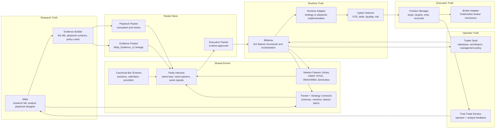

# Mala / Bhiksha Refactor Architecture

Status: proposal draft for review, not an implementation commitment.

## Purpose

This proposal describes how Mala and Bhiksha should look if we had the chance
to refactor them cleanly around the work we have now learned the hard way:

- Mala should remain the research lab, analyst, evidence compiler, and
  playbook-design surface.
- Bhiksha should remain the live runtime, feature recomputation engine, option
  selector, execution manager, and audit logger.
- The bridge between them should not depend on copied feature logic, loose
  strategy names, or trust that a runtime adapter "probably means the same
  thing."

The core refactor is to introduce a shared kernel and make parity a first-class
gate.

## North Star

```text
Mala = research lab + analyst + evidence compiler
Bhiksha = live runtime + feature recomputation + option/execution manager
Trader Desk = operator cockpit
Shared Kernel = feature/strategy/packet contracts both must obey
```

The important architectural boundary is not "Mala vs Bhiksha." The durable
boundary is:

```text
Research truth
Runtime truth
Execution truth
Operator truth
Feedback truth
```

Mala and Bhiksha should become applications on top of shared contracts rather
than two systems each carrying their own version of Newton, session semantics,
and strategy interpretation.

## Target Diagram



## Main Refactor Bet

Create a shared kernel used by both Mala and Bhiksha.

The shared kernel should own:

- canonical OHLCV bar schema
- timestamp, timezone, market-session, and trading-calendar semantics
- provider normalization rules
- Newton transforms
- feature names and feature specs
- strategy/playbook contracts
- packet schemas and versioning
- parity fixtures and comparison tools

This removes the most dangerous current failure mode: Mala fixes or evolves a
feature while Bhiksha keeps recomputing an older or merely similar version.

## Proposed Package Shape

The exact repo layout can be decided later, but conceptually:

```text
mala_bhiksha_kernel/
  bars/
    schema.py
    sessions.py
    calendars.py
    provider_normalization.py
  features/
    newton.py
    market_pulse.py
    vpoc.py
    vwap.py
    kinematics.py
  contracts/
    packets.py
    strategies.py
    playbooks.py
    capabilities.py
  parity/
    feature_compare.py
    signal_compare.py
    replay_fixture.py
```

Then:

```text
mala_v2
  imports shared kernel for research transforms, staged evidence, and playbooks

bhiksha
  imports shared kernel for live feature recompute, packet validation, and parity
```

If Bhiksha cannot use an exact shared implementation for a live provider
constraint, that adapter must be explicitly marked as an adapter and pass a
parity tolerance test against the shared kernel.

## Packet Types

The refactor should make packet names explicit.

### Evidence Packet

Used by the older M1-M5 lane.

```text
Mala hypothesis
  -> M1-M5 gates
  -> thesis-exit optimization
  -> provider review where relevant
  -> evidence_packet
  -> active_strategy authorization
  -> Bhiksha shadow/live
```

The evidence packet says: "Mala has evidence for this strategy configuration."

It does not say: "Bhiksha has proven runtime parity."

### Playbook Packet

Used by the Mala 2.2 consultant lane.

```text
Mala playbook design
  -> chart/replay consultation
  -> cohort evidence and policy card
  -> playbook_packet
  -> Bhiksha adapter/parity work
```

The playbook packet says: "Here is a reviewable playbook state and management
proposal."

It may remain advisory for a long time.

### Execution Packet

Used only after runtime readiness.

```text
evidence_packet or playbook_packet
  -> feature contract passes
  -> Bhiksha runtime adapter exists
  -> same-bars parity passes
  -> operator approves
  -> execution_packet
```

The execution packet says: "Bhiksha may shadow or trade this under the declared
mode and controls."

## Parity As A Gate

The core acceptance test should be:

```text
same input bars + same params
  -> same feature values within tolerance
  -> same signal timestamps/directions
  -> same thesis-exit decisions where applicable
```

Parity output should be an artifact, not just a unit-test pass:

```text
artifacts/parity/<packet_id>/<timestamp>/
  feature_diff.csv
  signal_diff.csv
  exit_diff.csv
  PARITY_REPORT.md
```

The report should classify mismatches:

- `feature_drift`
- `provider_drift`
- `warmup_drift`
- `session_boundary_drift`
- `strategy_semantic_drift`
- `exit_semantic_drift`

Promotion rule:

- No playbook packet becomes an execution packet until parity passes.
- No M1-M5 strategy gets live promotion if its active packet has unresolved
  parity misses or extra Bhiksha fires.

## Trader Desk

Trader Desk should sit inside or immediately above Bhiksha.

It should not be a research dashboard. It is the operating cockpit.

Minimum surface:

- current packet card
- take/pass
- arm/disarm
- management-policy selection
- option contract preview and selection rationale
- portfolio and buying-power context
- live position state
- stop/target/invalidation state
- square-off and emergency intervention
- post-trade feedback capture

For playbooks, the desk should feel like:

```text
Mala: "Here is the analyst card."
Operator: "Take or pass; choose management policy."
Bhiksha: "Here is the option, risk, and live management plan."
Operator: "Arm."
Bhiksha: "Execute, manage, reconcile, record."
Mala: "Consume the feedback later."
```

## Feedback Loop

Bhiksha should write structured feedback for both lanes:

- packet id and version
- operator decision: pass/take/arm/disarm
- feature snapshot at decision time
- option selected and why
- rejected option candidates and why
- entry fill or missed-entry reason
- stop/target/invalidation events
- realized outcome
- operator notes
- analyst notes
- post-close replay link

Mala should consume this as evidence and review input. Mala should not treat
live feedback as proof by itself; it should turn feedback into future research,
playbook refinement, and packet revisions.

## Migration Plan

### Phase 0: Freeze The Vocabulary

Decide and document the names:

- evidence packet
- playbook packet
- execution packet
- active strategy row
- runtime deployment
- Trader Desk
- shared kernel
- parity report

Deliverable: docs only.

### Phase 1: Parity Harness Before Shared-Kernel Extraction

Before moving files around, build the comparison tool against the current repos.

Start with the active older strategies:

- Market Impulse
- Opening Drive
- Jerk Pivot
- Elastic Band

Deliverable: a parity report that can say whether old wrong fires were likely
feature drift, provider drift, session drift, strategy drift, or execution drift.

### Phase 2: Extract Shared Kernel

Move the safest shared pieces first:

- bar schema
- session/calendar helpers
- feature names
- Newton transforms
- market-pulse/VMA/VWMA/VPOC helpers

Deliverable: Mala and Bhiksha both importing the same feature code for at least
one strategy family.

### Phase 3: Packet Registry

Formalize packet schemas and write/read paths.

Likely sources:

- `Mala_Evidence_v1` remains the human-visible sheet surface for older strategy
  evidence.
- A local or sheet-backed packet registry stores full JSON packet payloads.
- Bhiksha compiles from approved packet ids, not loose row blobs.

Deliverable: packet schema plus one compiled active-plan path using packet id
and version.

### Phase 4: Trader Desk

Build the operator cockpit on top of Bhiksha.

Reuse useful product ideas from `public_api_trading_v3`, but keep the execution
truth in Bhiksha:

- take/pass
- arm/disarm
- position health
- order lifecycle
- GDS-style option health metrics
- emergency controls
- review logging

Deliverable: supervised shadow desk before live automation.

### Phase 5: Playbook Automation

Only after the first playbook adapter passes parity, allow the consultant lane
to produce execution packets.

Deliverable: one playbook, one symbol basket, one option policy, one management
menu, shadow first.

## What This Refactor Avoids

- Mala becoming a broker runtime.
- Bhiksha blindly trusting research rows.
- `public_api_trading_v3` becoming a second execution brain.
- duplicated Newton transforms drifting silently.
- playbook consultation being confused with live authorization.
- M1-M5 evidence being confused with runtime parity.

## Open Questions

1. Should the shared kernel live as its own repo, a package inside `mala_v2`, or
   a package inside `openclaw-core`?
2. Should packet registry truth live in Google Sheets, SQLite, local JSON, or a
   hybrid where Sheets is the operator index and JSON is the payload?
3. Should Trader Desk be a Bhiksha-native UI or a separate surface above
   Bhiksha APIs?
4. Which strategy family should be the first parity harness target:
   Market Impulse, Opening Drive, or the new IWM/QQQ mean-reversion playbook?
5. How strict should feature tolerance be for provider-sensitive volume
   features?

## Recommendation

Do not start by extracting the shared kernel.

Start by building the parity harness against the current repos. It will tell us
which duplicated features are actually dangerous, which wrong fires were caused
by provider/session drift, and which pieces deserve extraction first.

Then extract the shared kernel with evidence, not assumptions.
