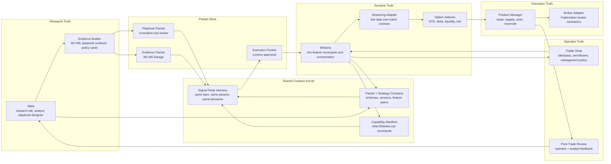

# Mala / Bhiksha Refactor Architecture

Status: active refactor implementation. The original proposal has crossed into
the first working cutover path for the mean-reversion-at-extremes playbook,
with IWM/QQQ as the first explored symbol universe, plus a cleaned
strategy-shadow lane that must prove itself under option-aware evidence.

## Immediate Action Status - 2026-05-17

1. **Trader Evidence Audit: action taken.** The option-translation evidence now
   called M6 was audited, the
   duplicate active exposure flagged by the audit was removed from
   `active_strategy`, and oldmac now verifies `11` strategy shadow rows plus
   `1` manual row with `0` suppressed rows and all deployments
   `shadow_only=true`. No trader input is needed before Monday shadow; the
   next decision is after runtime evidence: promote-review, retune, or kill.
2. **Source Surface Dead-Weight Review: action taken.** Legacy
   `Strategy_Catalog` publishers, old forensic scripts, and retired strategy
   modules have been moved out of active `src`; retired factory strategies no
   longer remain as hidden compatibility paths. Mala full suite is green:
   `332 passed`.
3. **Monday Shadow Readiness And Promotion Gates: action taken.** The oldmac
   daily shadow wrapper now has an active-plan preflight and fails fast unless
   the expected `11` strategy rows, `1` manual row, `0` suppressed rows, all
   enabled, and all `shadow_only=true` conditions hold. Promotion gates are
   explicit: live-review candidates need matched option fills, positive
   executable option evidence, clean plumbing, no manual artifact repair, and
   row-specific review. Weak rows are retuned or killed; they do not sit in
   the sheet by inertia.
4. **Playbook automation path: action taken.** The automated playbook lane now
   has a concrete `P1-P7` evaluator and spec: surface gate, packet freeze,
   parity, shadow authorization, shadow feedback, live approval, and automation.
   Shadow is intentionally allowed after P1-P4 because it is no-capital runtime
   feedback. Locked stress evidence is useful for later promotion decisions,
   but it is no longer a prerequisite for Bhiksha shadow. Full automation
   remains blocked until feedback ingestion and a separate autonomous-control
   approval exist.

**Open questions:** none blocking Monday strategy shadow. For the automated
playbook lane, the next concrete action is to run the current IWM/QQQ
exploration packet through Bhiksha shadow and ingest the resulting feedback
back into Mala.

## Milestone Log

- 2026-05-16: Created refactor work surfaces: `mala_v2` and `bhiksha` on `codex/shared-contract-refactor`, plus new `mala-bhiksha-kernel` repo.
- 2026-05-16: Landed the first minimal kernel: packet schemas, capability manifest, signal parity primitives, registry helpers, and green kernel tests.
- 2026-05-16: Wired Mala to write the first IWM/QQQ exploration packet for the mean-reversion-at-extremes playbook and generated the first canonical packet registry index.
- 2026-05-16: Wired Bhiksha packet compilation to validate shared-kernel packets and fail closed unless an approved execution packet has declared runtime capability.
- 2026-05-16: Added the first signal-parity artifact path for the reversion playbook; current report is blocked with `runtime_adapter_missing`, not passed.
- 2026-05-16: Verified the refactor path end to end: kernel `3 passed`, Mala `336 passed`, and Bhiksha `253 passed`.
- 2026-05-16: Added Bhiksha RTH feature transforms for `opening_vwap_rth`, prior-RTH-close ATR/gap state, and relative RTH volume; focused Bhiksha tests pass.
- 2026-05-16: Added and registered Bhiksha's `intraday_mean_reversion_extremes` adapter with a focused synthetic signal test.
- 2026-05-16: Added a Bhiksha runtime-event export tool for mean-reversion parity CSVs; focused export test passes.
- 2026-05-16: Added Bhiksha's shared-kernel capability manifest generation; reversion remains explicitly blocked with `signal_parity_not_passed`.
- 2026-05-16: Re-verified after the adapter lift: kernel `3 passed`, Mala `336 passed`, and Bhiksha `260 passed`.
- 2026-05-16: Added comparable Mala and Bhiksha signal-event exporters with config-specific parity keys; focused exporter tests pass.
- 2026-05-16: Ran full IWM/QQQ reversion signal parity: `21,127` Mala events vs `21,127` Bhiksha events, `0` missing, `0` extra; entry shadow capability is now supported.
- 2026-05-16: Created and pushed the private `skishore1676/mala-bhiksha-kernel` repository for the shared kernel.
- 2026-05-16: Added the playbook consultation layer guide and a consultation-log `status` command so replay batches have an explicit next action before promotion.
- 2026-05-16: Added Bhiksha's diagnostic legacy-retirement gate; current old-lane scan blocks on `8` active legacy wires pending retirement or fresh re-promotion.
- 2026-05-16: Drafted the first shadow execution packet for the reversion playbook from the passed parity report; Bhiksha compile correctly blocks it pending operator approval and legacy retirement.
- 2026-05-16: Retired the old Bhiksha strategy/deployment wires from runtime reachability; the legacy-retirement report is now clear and the reversion execution packet blocks only on review status and operator approval.
- 2026-05-16: Approved the reversion execution packet for Bhiksha shadow-only activation; compile now passes with runtime controls forbidding live automation.
- 2026-05-16: Added the Bhiksha-native playbook consultation bridge; Bhiksha can now verify the shadow packet, call Mala's query/policy card, and record the consultation artifact without placing orders.
- 2026-05-16: Added the Bhiksha operator decision layer; consultation artifacts can now become red/green shadow intents with a required allowed management policy and `order_submission_allowed=false`.
- 2026-05-16: Added the Bhiksha option-preview layer; `shadow_intent_ready` artifacts can now resolve an option candidate and run chain/quote/risk checks while still requiring live approval.
- 2026-05-16: Split the post-preview path into parallel shadow and live lanes: shadow records executable option PnL, while live creates an explicit approval ticket that is not yet a broker submission.
- 2026-05-16: Added the Bhiksha packet-native lifecycle submitter; future `live_approval_gated` packets can turn approved live tickets into managed entries with stop/target rules, while the current shadow-only packet is refused.
- 2026-05-16: Added packet-declared management-policy specs; Mala now writes stop/target/hard-flat management contracts and Bhiksha option preview/live lifecycle consume those specs instead of relying on hidden defaults.
- 2026-05-16: Generated approved reversion execution packet v2 as `live_approval_gated` for the Monday small-account pilot; live automation is still forbidden and every order requires an explicit live ticket.
- 2026-05-16: Added Bhiksha live underlying-anchor management; an open playbook lifecycle can now monitor the packet-declared stop anchor and hard-flat time, then submit an emergency close only when run with `--execute`.
- 2026-05-17: Added the option-exit layer, now called M6, for the strategy lane: minute-based hold-time metrics, DTE-aware theta penalty, option-adjusted expectancy, option tradeability gates, dynamic Sheet readback validation, and active-strategy execution overrides.
- 2026-05-17: Rebuilt and published `Mala_Evidence_v1` from the current M5 candidate set: `36` evidence rows, `53` columns, `0` readback mismatches.
- 2026-05-17: Cleaned `active_strategy` down to the `11` rows intended for aggressive shadow, each with a one-week learning note; Bhiksha active-plan compile and zero-bar dry startup passed with all strategy deployments `shadow_only=true`.
- 2026-05-17: Archived the old evidence book and pre-M6 option-exit book so the live review surface is the current `Mala_Evidence_v1` plus current `active_strategy`, not two competing books.
- 2026-05-17: Completed the next Mala deletion pass: legacy `Strategy_Catalog` publishers and forensic scripts moved to archive, dead strategy modules removed from active `src`, and factory reachability cut for `Kinematic Ladder`, `Regime Router (Kinematic + Compression)`, `Opening Drive v2 (Short Continue)`, and `EMA Momentum`.
- 2026-05-17: Verified the deletion pass with Mala full suite `332 passed`; canonical handoff still generates `36` rows.
- 2026-05-17: Added active-plan preflight to the oldmac daily shadow wrapper: expected `11` strategy deployments, `1` manual deployment, `0` suppressed rows, all enabled, all `shadow_only=true`.
- 2026-05-17: Added the playbook automation gate evaluator and canonical spec: `src.research.playbook_automation_gates` plus `docs/PLAYBOOK_AUTOMATION_GATES.md`.
- 2026-05-30: Reworked the playbook promotion ladder to `P1-P7`, removing locked validation as a blocker before no-capital Bhiksha shadow, and drafted `Mala_Playbook_Evidence_v2` as the playbook packet passport.
- 2026-05-17: Reconciled the Mala 2.2 vision/refactor docs with the current two-lane model and moved stale runtime reports out of the active report surface.

## Current Stock Check

As of 2026-05-17, the refactor is no longer only an architecture proposal. Two
lanes are now distinct:

1. **Kernel/playbook lane:** the mean-reversion-at-extremes playbook has its
   first clean shared-contract target in the IWM/QQQ exploration packet.
2. **Strategy-shadow lane:** legacy M1-M5 families are not grandfathered, but
   a small set has re-earned short-term shadow through M6 option-aware
   evidence, M7 provider translation, and current `active_strategy` approval.

### Done

- **Shared kernel exists.** `mala-bhiksha-kernel` is a private repo with shared
  packet schemas, capability manifests, parity primitives, registry helpers,
  and tests.
- **Packet registry path exists.** Mala writes canonical playbook/execution
  packet JSON and a registry index. Bhiksha compiles against packet id +
  version rather than a loose strategy name.
- **Bhiksha fail-closed compile exists.** Unsupported, unapproved,
  version-mismatched, shadow-only, or legacy-blocked packets are refused with
  named reasons.
- **First playbook parity passed.** Mala and Bhiksha produced matching
  IWM/QQQ mean-reversion signal events: `21,127` vs `21,127`, with `0`
  missing and `0` extra. Bhiksha now verifies the referenced parity report is
  present and `passed` at packet compile time, but parity is not yet a CI gate.
- **Old Bhiksha runtime wires are retired from reachability.** The diagnostic
  retirement gate is clear; old promoted strategies are no longer silently
  available as runtime authorization paths.
- **Mala legacy source reachability is cut.** Legacy `Strategy_Catalog`
  publishers, catalog volume forensics, volume mismatch retune helpers, and
  retired strategy implementations have been moved out of the active tree into
  the external prune archive. Active strategy factory reachability is limited
  to current strategy families.
- **M6 option-aware strategy evidence exists.** Mala now selects exits by
  option-adjusted expectancy, velocity, rapid target hit rate, lower hold time,
  profit factor, and win rate. The theta model uses wall-clock minutes instead
  of bar-count denominators.
- **M7 provider translation is Mala-owned.** Provider parity and exact-row
  signal translation are research gates before Bhiksha shadow, not execution
  surprises discovered by Bhiksha. Bhiksha can later reconcile shadow/live
  execution, but it does not build Mala evidence columns.
- **`Mala_Evidence_v1` is current and read back.** The current evidence publish
  is `36` rows by `53` columns with zero readback mismatches.
- **`active_strategy` is cleaned for aggressive shadow.** The active strategy
  sheet contains the `11` rows intended to shadow now, not the prior mixed
  20-row surface. Each row carries a one-week learning note.
- **Reversion execution packet v1 is approved for shadow.** It is compileable
  by Bhiksha, but runtime controls forbid live automation.
- **Reversion execution packet v2 is approved for live approval-gated pilot.**
  It is compileable by Bhiksha as `live_approval_gated`; runtime controls
  still forbid automation, cap the first pilot to one contract / $300 premium,
  require an explicit live ticket, and require an underlying stop price.
- **Consultation lane exists.** Bhiksha can verify the packet, call Mala's
  query/policy card, and record a consultation artifact without placing orders.
- **Operator decision lane exists.** A consultation can become a red/green
  shadow intent with required management-policy selection and
  `order_submission_allowed=false`.
- **Option preview exists.** A ready shadow intent can resolve an option
  candidate and run quote/chain/risk checks before any live authorization.
- **Parallel shadow/live lanes exist.** Shadow can record executable option
  PnL; live can create an explicit approval ticket but not submit it directly.
- **Lifecycle submitter exists.** A `live_approval_gated` packet plus
  approved live ticket can drive entry submission, fill/reconcile handling,
  stop/target arming, trade-state persistence, and lifecycle artifacts.
- **Management policies are packet-declared.** The reversion execution packet
  now carries `runtime_controls.management_policy_specs` with stop family,
  stop anchor, exit family, target model, target R, hard-flat time, and option
  stop fallback.
- **Underlying-anchor monitor exists.** Bhiksha can evaluate the open lifecycle
  against the packet-declared underlying stop anchor and hard-flat time. It
  writes management artifacts in dry-run mode and submits an emergency close
  only when the operator runs the monitor with `--execute`.
- **Current live safety holds.** v2 opens only the approval-gated pilot path:
  no autonomous live entry, no live entry without a ticket, and no management
  without an underlying stop price.

### In Progress

- **Phase 5/6 bridge.** We now have most of the backend substrate for the
  operator flow, but not yet a minimal Trader Desk surface that the operator
  can use without scripts.
- **Feedback-to-Mala loop.** Bhiksha writes consultation, intent, preview,
  shadow/live-lane, and lifecycle artifacts, but Mala does not yet consume
  those feedback artifacts as a first-class review/research input. This is the
  binding constraint on closing the research -> runtime -> feedback loop.
- **Consultation product proof.** The consultation lane is available, but it is
  not validated as a durable product habit yet; that requires real operator use
  across a declared sample.
- **Management-policy execution depth.** Bhiksha now consumes packet-declared
  management specs through option preview, lifecycle submission, and live
  underlying-anchor monitoring. The next depth layer is broker/position
  reconciliation over a continuous session, not just one command invocation.
- **Live approval promotion.** The reversion packet has a v2
  `live_approval_gated` version for a small-account pilot, but live automation
  remains explicitly disallowed.
- **Strategy-shadow promotion learning.** The 11-row strategy packet is
  intentionally aggressive shadow. The decision in one to two weeks is promote,
  retune, or kill based on executable option behavior, not old underlying
  expectancy.
- **Playbook promotion gates.** The playbook lane now has a concrete `P1-P7`
  evaluator. It can show whether a packet is ready for Bhiksha shadow,
  whether shadow feedback is sufficient for live approval review, and why full
  automation remains blocked until feedback ingestion and autonomous-control
  approval are built.

### Next Pickup

1. Run Monday's strategy-shadow lane as an autonomous check-in loop: confirm
   the 11 active rows are loaded, collect shadow events, and summarize what
   each row taught us against its one-week note.
2. Build the minimal Bhiksha-native Trader Desk/API surface for the existing
   lane: load packet, consult, take/pass, choose management policy, run option
   preview, start shadow, view position state, and show live block reasons.
3. Push the current reversion shadow packet through the `P1-P4` gate report and
   run Bhiksha shadow as the feedback-generating step. Locked stress can be
   attached later as promotion evidence, but should not block shadow.
4. Add the feedback ingestion bridge back into Mala so shadow outcomes and
   operator/analyst notes become packet-versioned review artifacts.
5. Expand the monitor into a first-class Bhiksha service/desk control with
   broker/position reconciliation, visible health, and emergency square-off.
6. Define the promotion bar from `shadow` to `live_approval_gated`: minimum
   trade count, non-negative executable expectancy, no manual artifact fixups,
   and operator sign-off.
7. For rows that do not shadow enough, decide whether they get a bounded
   retune packet or are killed. No idle row should remain authorized because
   it once looked interesting.

### Current Blockers

- No operator-facing Trader Desk yet.
- No automated Mala feedback ingestion yet.
- No CI parity rerun gate yet; today's passed report is evidence plus compile
  validation, not drift-proofing.
- No current packet is allowed to place live orders without an explicit live
  ticket and operator-run submit command.
- Strategy-shadow outcomes are not yet flowing back into Mala as structured
  promotion/retune/kill evidence.

## Doc Status

Current docs:

- [`MALA_VISION_v2.2.md`](MALA_VISION_v2.2.md): doctrine and mental model.
- [`MALA_BHIKSHA_REFACTOR_ARCHITECTURE.md`](MALA_BHIKSHA_REFACTOR_ARCHITECTURE.md): state of state and next actions.
- [`MALA_BHIKSHA_OPERATING_LANES.md`](MALA_BHIKSHA_OPERATING_LANES.md): lane boundaries.
- [`PLAYBOOK_AUTOMATION_GATES.md`](PLAYBOOK_AUTOMATION_GATES.md): playbook automation gate contract.
- [`MALA_PLAYBOOK_EVIDENCE_V2.md`](MALA_PLAYBOOK_EVIDENCE_V2.md):
  proposed playbook packet evidence passport for Bhiksha adoption.
- [`PLAYBOOK_CONSULTATION_LAYER.md`](PLAYBOOK_CONSULTATION_LAYER.md) and
  [`PLAYBOOK_REPLAY_CONSULTATION_SOP.md`](PLAYBOOK_REPLAY_CONSULTATION_SOP.md):
  active consultation workflow.
- [`MALA_PUBLICATION_GUARDRAILS.md`](MALA_PUBLICATION_GUARDRAILS.md):
  publication safety rules.
- [`SHADOW_CAMPAIGN_PLAN.md`](SHADOW_CAMPAIGN_PLAN.md) and
  [`SHADOW_DECISION_PROTOCOL_NEXT_WEEK.md`](SHADOW_DECISION_PROTOCOL_NEXT_WEEK.md):
  current aggressive strategy-shadow operating rules.

Closed or historical docs:

- [`MALA_2_2_FIRST_SLICE.md`](MALA_2_2_FIRST_SLICE.md) and
  [`MALA_2_2_INTRADAY_REVERSION_SURFACE_SPEC.md`](MALA_2_2_INTRADAY_REVERSION_SURFACE_SPEC.md):
  implemented build contracts.
- [`MALA_BHIKSHA_PARITY_AUDIT_2026-05-16.md`](MALA_BHIKSHA_PARITY_AUDIT_2026-05-16.md):
  completed audit snapshot.
- External prune archive: old runtime reports, one-time audits, and
  pre-refactor campaign artifacts removed from the active source tree.

## Purpose

This proposal describes how Mala and Bhiksha should look if we had the chance
to refactor them cleanly around the work we have now learned the hard way:

- Mala should remain the research lab, analyst, evidence compiler, and
  playbook-design surface.
- Bhiksha should remain the live runtime, feature recomputation engine, option
  selector, execution manager, and audit logger.
- The bridge between them should not depend on copied feature logic, loose
  strategy names, or trust that a runtime adapter "probably means the same
  thing."

The core refactor is to introduce a small shared contract kernel, make packet
authorization explicit, and make signal-level parity a first-class gate. Feature
extraction should come after parity evidence, not before it.

The refactor is also a clean transition, not a careful preservation. The old
broad M1-M5 shadow campaign ran roughly 30% win rate with negative expectancy
over the last month. There is no runtime behavior to preserve by default.
Re-evaluating those hypotheses against the new contracts is an unavoidable
cost and is treated here as a feature, not a regression. The kernel/playbook
lane carries over the mean-reversion-at-extremes playbook through its first
IWM/QQQ exploration packet. The strategy-shadow lane carries only the rows that
re-earned current M6 option-aware evidence and explicit active authorization.

Legacy code paths are deleted as families migrate. Dead strategies are retired
loudly, not parked. Human review of a system half-converted is harder and
more dangerous than human review of a clean cutover, so dual-wire periods are
treated as short transition states, not steady-state architecture.

## North Star

```text
Mala = research lab + analyst + evidence compiler
Bhiksha = live runtime + feature recomputation + option/execution manager
Trader Desk = operator cockpit
Shared Contract Kernel = packet, capability, and parity contracts both must obey
```

The important architectural boundary is not "Mala vs Bhiksha." The durable
boundary is:

```text
Research truth
Runtime truth
Execution truth
Operator truth
Feedback truth
```

Mala and Bhiksha should become applications on top of shared contracts rather
than two systems each carrying their own version of Newton, session semantics,
and strategy interpretation.

## Success Criteria

The phases are servants of these invariants. The refactor is done when all
four hold:

1. **No unmeasured handoff.** Every Mala -> Bhiksha promotion has a signal
   parity report attached as evidence. No strategy or playbook enters shadow
   or live without one.
2. **No silent feature drift.** A feature lives in one place, or in two places
   with an explicit adapter+tolerance test that fails the build when the gap
   widens. No third copy is allowed. Current state: the reversion playbook has
   a passed parity report and compile-time parity-report validation, but there
   is not yet a CI rerun gate and the feature library has not moved into the
   kernel.
3. **No untraceable execution.** No trade fires without an approved packet id
   and version on record. The audit chain runs from operator decision to fill
   to feedback without gaps.
4. **No silent strategy decay.** Negative-expectancy strategies trip an
   explicit sunset rule. They do not keep running quietly while attention is
   elsewhere.

If those four hold, the refactor is done. If they do not, more phases. They
are also the criteria that decide whether agents can take more of the
operator loop over time.

## Strategies Carrying Over

The refactor assumes a clean baseline, not a careful preservation:

- **Carrying over into the kernel/playbook lane:** the IWM/QQQ mean-reversion
  playbook. It is the first shared-contract parity target and the only current
  approval-gated live pilot candidate.
- **Allowed into strategy shadow:** only rows that re-earned their place through
  M6 option-aware evidence, M7 provider translation, and explicit
  `active_strategy` cleanup. They are shadow candidates, not live candidates.
- **Not carrying over:** any old M1-M5-promoted strategy that did not re-earn
  current evidence and active authorization.

Every retired strategy that wants to come back must re-run its evidence,
option-exit selection, runtime capability, and operator approval against the
new contracts. No grandfathering. Old M1-M5 runs become research leads, not
runtime assets.

The old broad shadow campaign is closed. The current strategy-shadow lane is a
new, smaller packet whose job is to generate executable option evidence over
the next one to two weeks. Rows that do not produce enough signal are retuned
or killed; they do not sit in the sheet indefinitely.

This is treated as a cost, not a loss. A month of negative-expectancy shadow
is enough signal that the old configurations are not worth carrying. The
research effort to re-run hypotheses is a known, bounded cost. The cost of
carrying ambiguous legacy through a refactor is unbounded and corrodes human
review.

## Five Contracts, Four Promotion Gates

The refactor should be argued as contracts between truths, not as a folder
layout question.

```text
Research truth  --[evidence packet]---------------> Operator truth
Operator truth  --[playbook packet / arm decision]-> Runtime truth
Runtime truth   --[execution packet + parity]-----> Execution truth
Execution truth --[fill / fire / outcome events]--> Feedback truth
Feedback truth  --[review artifact]---------------> Research truth
```

The first four crossings are gates that promote or authorize behavior. The last
crossing is the learning loop back into research.

This framing lets us debate each crossing independently:

- what artifact crosses the boundary
- who is allowed to approve it
- what can block it
- what must be recorded afterward

## Target Diagram



## Main Refactor Bet

Create a shared contract kernel used by both Mala and Bhiksha.

The minimum viable kernel should own:

- feature names and feature specs
- packet schemas and versioning
- capability manifest schema
- parity report schema
- parity fixtures and comparison tools

It should not initially own all Newton transforms, calendars, provider
normalization, and strategy implementations. Those are extraction candidates,
not starting assumptions.

This keeps the first move small enough to land cleanly and still attacks the
real problem: unversioned handoff plus unmeasured runtime drift.

## Explicit Bets

Before moving code, the proposal rests on three bets:

- **Bet A: drift is a dominant failure mode.** If wrong Bhiksha fires mostly
  came from Mala/Bhiksha recomputation drift, parity will expose it and shared
  extraction will pay off. If wrong fires mostly came from weak research edges,
  the fix is research quality, not architecture.
- **Bet B: consultation is a durable product.** If the trader keeps using the
  playbook consultant lane as its own workflow, playbook packets are worth
  naming separately. If consultation is just a temporary review state, one
  packet type with states may be simpler.
- **Bet C: Trader Desk is load-bearing.** If the desk gates execution decisions,
  it belongs in the refactor path. If it is only a better viewer, it should
  come after parity and packet authorization.

## Proposed Package Shape

The exact repo layout can be decided later, but conceptually:

```text
mala_bhiksha_kernel/
  contracts/
    packets.py
    strategies.py
    playbooks.py
    capabilities.py
  parity/
    signal_compare.py
    feature_diagnostics.py
    replay_fixture.py
    report_schema.py
```

Then:

```text
mala_v2
  imports shared kernel for packet writing, capability checks, and parity reports

bhiksha
  imports shared kernel for packet validation, capability manifest, and parity reports
```

Later, parity evidence may justify moving specific feature modules into the
kernel:

```text
mala_bhiksha_kernel/
  bars/
  sessions/
  features/
```

But that extraction should happen one strategy family at a time.

## Operational Setup

The implementation should start with isolated work surfaces:

```text
mala_v2 branch:    codex/shared-contract-refactor
bhiksha branch:    codex/shared-contract-refactor
new repo/package:  mala-bhiksha-kernel
```

The first working branch should not change live behavior. It should produce
parity reports against current behavior. Once a family is migrated and proven,
the old duplicated path for that family should be deleted rather than kept as a
parallel wire.

## Packet Types

The refactor should make packet names explicit.

### Evidence Packet

Used by the older M1-M5 lane.

```text
Mala hypothesis
  -> M1-M5 gates
  -> thesis-exit optimization
  -> provider review where relevant
  -> evidence_packet
  -> active_strategy authorization
  -> Bhiksha shadow/live
```

The evidence packet says: "Mala has evidence for this strategy configuration."

It does not say: "Bhiksha has proven runtime parity."

### Playbook Packet

Used by the Mala 2.2 consultant lane.

```text
Mala playbook design
  -> chart/replay consultation
  -> cohort evidence and policy card
  -> playbook_packet
  -> Bhiksha adapter/parity work
```

The playbook packet says: "Here is a reviewable playbook state and management
proposal."

It may remain advisory for a long time.

### Execution Packet

Used only after runtime readiness.

```text
evidence_packet or playbook_packet
  -> feature contract passes
  -> Bhiksha runtime adapter exists
  -> same-bars parity passes
  -> operator approves
  -> execution_packet
```

The execution packet says: "Bhiksha may shadow or trade this under the declared
mode and controls."

## Parity As A Gate

Parity pass/fail should be judged at the signal and decision layer:

```text
same input bars + same params
  -> same signal timestamps/directions
  -> same invalidation timestamps
  -> same thesis-exit decisions where applicable
```

Feature diffs are diagnostics for disagreements. They should explain why a
signal missed or fired extra; they should not be the primary pass/fail
primitive. A tiny feature delta can be harmless far from a threshold and
catastrophic at the threshold.

Parity output should be an artifact, not just a unit-test pass:

```text
research/results/playbook_parity/<packet_id>/<timestamp>/
  signal_diff.csv
  feature_diagnostics.csv
  exit_diff.csv
  PARITY_REPORT.md
```

The report should classify signal disagreements:

- `feature_drift`
- `provider_drift`
- `warmup_drift`
- `session_boundary_drift`
- `strategy_semantic_drift`
- `exit_semantic_drift`

Promotion rule:

- No playbook packet becomes an execution packet until parity passes.
- No M1-M5 strategy gets live promotion if its active packet has unresolved
  parity misses or extra Bhiksha fires.

## Packet Registry

Packet registry is load-bearing because packet id + version should become the
unit of authorization.

Recommended default:

```text
canonical packet body: git-tracked JSON
operator index:        generated Google Sheet row
runtime compile:       Bhiksha reads approved packet id + version
```

Sheets remain the human control tower, but the full packet payload should not
be an editable row blob. The sheet should expose status, owner, approval,
summary, and links. The immutable JSON body should preserve what was actually
approved.

If we are not willing to build the registry, then we should not pretend packet
ids are authoritative. In that fallback world, `active_strategy` remains the
authorization unit and the refactor is smaller.

## Streaming Adapter

The runtime adapter should be named as a streaming adapter, not a vague strategy
adapter.

Batch research assumes completed bars and stable historical windows. Live
runtime deals with partial bars, late ticks, missing volume, provider gaps, and
ordering. The adapter's job is to reconcile live streaming data into the batch
contract that parity tested.

That distinction matters:

- semantic mismatch means the strategy or feature contract is wrong
- streaming mismatch means live data shape differs from historical batch shape
- provider mismatch means the same contract is fed different market data

## Trader Desk

Trader Desk should sit inside or immediately above Bhiksha.

It should not be a research dashboard. It is the operating cockpit.

Critical-path surface:

- arm/disarm
- emergency square-off
- packet status
- current position-state dump
- runtime block reason

Product surface, after parity and authorization are stable:

- current packet card
- take/pass
- management-policy selection
- option contract preview and selection rationale
- portfolio and buying-power context
- stop/target/invalidation state
- GDS-style option health metrics
- post-trade feedback capture

For playbooks, the desk should feel like:

```text
Mala: "Here is the analyst card."
Operator: "Take or pass; choose management policy."
Bhiksha: "Here is the option, risk, and live management plan."
Operator: "Arm."
Bhiksha: "Execute, manage, reconcile, record."
Mala: "Consume the feedback later."
```

## Agents And The Operator Loop

The long-term goal is that operator involvement reduces over time. Agents
absorb the routine steps once the contracts, parity, and feedback loops are
strong enough to make their work auditable.

The agent surface already sketched in `openclaw-core/workspace/agents/`
maps onto this architecture:

```text
research_lab    -> research truth      (hypothesis intake, evidence orchestration, journal continuity)
or_research     -> research truth      (external scouting, source vetting, weekly digest)
kamandal_ops    -> runtime + execution (current shadow/audit ops precedent)
trade_lab       -> operator/runtime    (paused reference surface, possible future desk lane)
bhiksha_ops     -> runtime + execution (future worker if Trader Desk becomes Bhiksha-native)
```

Do not reuse `radhe_ops` for trading. It is Radhe-specific. If Trader Desk
becomes its own agent surface, it should be revived through `trade_lab` or a
new `bhiksha_ops` worker with explicit source boundaries.

What is true today:

- agents do not autonomously promote
- agents do not autonomously trade
- agents work behind human approval gates
- agents read and write artifacts the operator can review

What the refactor unlocks for them:

- **Packet ids and versions** give agents a stable thing to reason about.
  Without them, agents either summarize sheets they cannot trust or
  hand-build context from scratch every time.
- **Parity reports** give agents a structured artifact to consume. Approval
  recommendations can be grounded in named drift categories instead of vibes.
- **Feedback artifacts** close the loop so an agent reviewing tomorrow can
  see what happened to a packet today.
- **Capability manifests** let an agent answer "is this executable yet" with
  the same fail-closed rule the runtime uses, rather than guessing.

Agent involvement should expand only when each success-criterion invariant
strengthens. A rough order:

1. **Read-only assist.** Agents summarize packets, parity, and feedback for
   the operator. No state changes. Available the moment Phase 2 lands.
2. **Drafting role.** Agents draft evidence packets, parity-report
   commentary, and post-trade reviews for operator approval. Available once
   feedback artifacts are reliably structured (after Phase 5).
3. **Gated promotion role.** Agents propose promotions from evidence to
   playbook packet or playbook to execution packet, with a mandatory human
   approval step that is itself versioned and auditable. Available only
   after the four success-criterion invariants have held over a meaningful
   window.
4. **Autonomous within bounded scope.** Agents act without per-event human
   approval inside narrow, explicitly-bounded loops (e.g. retuning a single
   parameter within an authorized region, with a kill switch). Earned, not
   assumed.

The north star is that the trader becomes the approver and final reviewer,
not the daily operator. The refactor's contracts, parity, and feedback
artifacts are the substrate that makes that trust possible. Until those
hold, agent autonomy stays narrow.

## Feedback Loop

Bhiksha should write structured feedback for both lanes:

- packet id and version
- operator decision: pass/take/arm/disarm
- feature snapshot at decision time
- option selected and why
- rejected option candidates and why
- entry fill or missed-entry reason
- stop/target/invalidation events
- realized outcome
- operator notes
- analyst notes
- post-close replay link

Mala should consume this as evidence and review input. Mala should not treat
live feedback as proof by itself; it should turn feedback into future research,
playbook refinement, and packet revisions.

## Migration Plan

Each phase has a goal, a deliverable, and a stop condition. A phase is not
done because the deliverable exists; it is done when the stop condition
holds.

### Phase 0: Freeze Vocabulary And Authorization

**Progress: complete for the first refactor slice.**

**Goal.** Make the language unambiguous so later phases do not relitigate it.

**Decide and document:**

- evidence packet
- playbook packet
- execution packet
- active strategy row
- runtime deployment
- Trader Desk
- shared contract kernel
- parity report
- packet id + version as the preferred authorization unit
- canonical packet body vs generated operator index

**Deliverable.** Updated docs only.

**Stop condition.** Operator, research, and ops surfaces all reference the
same vocabulary in their working docs. No competing terms remain in active
use.

**Current note.** The active docs now distinguish evidence packets, playbook
packets, execution packets, shadow intents, live approval tickets, and
lifecycle submissions.

### Phase 1: Shadow Wind-Down And Forensic Parity

**Progress: partly complete, deliberately narrowed.**

**Goal.** Stop the bleeding and learn from it before opening the refactor.

The current M1-M5 shadow campaign is wound down. A one-shot forensic parity
run is done against the existing strategies (Market Impulse, Opening Drive,
Jerk Pivot, Elastic Band) to classify last month's wrong fires as feature
drift, provider drift, session drift, strategy drift, or execution drift.
This run is **post-mortem evidence, not migration scaffolding**. Its job is
to inform what changes in the new kernel, not to preserve the old strategies.

**Deliverable.**

- shadow stopped, with state archived
- forensic parity report written and circulated
- explicit list of which drift categories were dominant
- explicit list of what the M-gates should change to not promote those
  edges again

**Stop condition.** Forensic report is written, M-gate calibration changes
are agreed, and there is no live or shadow execution running until the new
authorization path opens.

**Current note.** The old runtime wires have been retired from Bhiksha
reachability, so the bleeding is stopped. A full forensic report on every old
M1-M5 strategy has not been completed; that work is now intentionally deferred
until a retired family is worth re-hypothesizing.

### Phase 1.5: Legacy Retirement, No Grandfathering

**Progress: complete for runtime reachability and Mala active-source reachability.**

**Goal.** Make it impossible to silently carry an old strategy forward.

Every currently promoted M1-M5 strategy is retired explicitly. None is
grandfathered into the new architecture. Any of them that wants to come back
must:

- be re-hypothesized against the new contracts
- pass M-gates as recalibrated in Phase 1
- have a kernel-importable implementation
- pass signal parity in the new harness
- earn operator approval as a fresh packet id

**Deliverable.**

- written retirement statement per strategy
- archived research artifacts and tunings, marked non-live
- legacy execution code paths removed from Bhiksha as their migration
  candidates open in Phase 4 (not kept indefinitely)
- legacy Mala publishers, forensic scripts, and retired strategy modules moved
  out of active `src`

**Stop condition.** The only thing the new-path runtime can compile and
execute is an explicitly approved packet or active strategy row. Everything
else is either retired or re-promoted through the new path. Old code may exist
only as archived source; it must not be reachable by operator authorization or
active factory/import paths.

**Current note.** Bhiksha's legacy-retirement gate is clear, and the new-path
compile surface no longer authorizes the old promoted strategy wires. Mala's
active source no longer imports legacy `Strategy_Catalog` publishers, and the
retired factory strategies have been moved to archive rather than kept as
hidden compatibility paths.

### Phase 2: Minimal Kernel And Registry

**Progress: complete for the first packet family.**

**Goal.** Make packet id + version the unit of authorization, not a sheet
row.

Create the small shared contract kernel:

- feature names
- packet schemas
- capability manifest schema
- parity report schema
- replay fixtures

Create the first packet registry path:

- immutable JSON packet body (git-tracked)
- generated sheet/index row
- Bhiksha reads approved packet id and version

**Deliverable.** One packet (the reversion playbook) can be written,
indexed, approved, and compiled without changing live execution behavior.

**Stop condition.** Bhiksha refuses to compile any packet that is not in
the registry with an approved id and version. The refusal is loud and
named (`packet_not_in_registry`, `packet_not_approved`,
`packet_version_mismatch`).

**Current note.** The private `mala-bhiksha-kernel` repo exists, the first
registry path exists, and Bhiksha compiles/refuses packets by packet id,
version, approval state, runtime mode, capability, and legacy-retirement
state.

### Phase 3: First Forward Parity Target

**Progress: complete for IWM/QQQ mean reversion.**

**Goal.** Prove signal parity on the one strategy that matters now.

Build the signal parity harness against the reversion playbook on the
shared kernel. Feature diffs are diagnostics, not the primary criterion.

**Deliverable.** Parity report for the reversion playbook showing zero
unexplained signal disagreements over the test window.

**Stop condition.** The playbook can produce an execution packet (Phase 6
will arm it). All disagreements are either resolved or explicitly
categorized and accepted as adapter tolerance.

**Current note.** The reversion parity report passed with `21,127` Mala events
and `21,127` Bhiksha events, with `0` missing and `0` extra. The packet can
compile for shadow-only execution.

### Phase 4: Hard Cutover Per Family

**Progress: complete for legacy strategy reachability in current Mala/Bhiksha
surfaces; incomplete for shared feature extraction.**

**Goal.** No permanent dual-wire confusion.

For each feature family migrated into the kernel:

```text
old path remains only until replacement passes
new path becomes default
old duplicated wire is deleted from both repos
failures become loud in test and fail-closed in runtime
```

Legacy strategies that have not earned re-promotion do not get a migrated
path; their code is removed when the family they relied on migrates.

**Deliverable.** Each migrated family has exactly one implementation,
imported by both Mala and Bhiksha. Removed strategies are removed, not
gated off.

**Stop condition.** A grep across both repos finds no duplicated feature
implementation, no `# old path` comment, and no disabled-but-present
legacy strategy code.

**Current note.** Old runtime wires are no longer reachable, and Mala's active
factory/import surface no longer exposes retired strategies. This satisfies
the no-grandfathering side of the phase for the current working surfaces. The
phase is still not globally done because shared feature extraction remains
evidence-driven and incomplete; only families under active parity or runtime
pressure should move into the kernel.

### Phase 5: Minimal Trader Desk

**Progress: backend lane exists; operator surface not built.**

**Goal.** Operator can authorize, monitor, and intervene without a
terminal.

Critical path only:

- arm/disarm
- packet status (id, version, parity state)
- position-state dump
- emergency square-off
- runtime block reason

**Deliverable.** A working desk over Bhiksha APIs with those controls and
nothing else.

**Stop condition.** Operator completes a full arm -> execute -> square-off
cycle from the desk for the reversion playbook in shadow, and unauthorized
execution attempts are blocked with a named reason. Operator uses the desk
for a continuous shadow window without falling back to manual scripts.

**Current note.** Bhiksha has the consultation, operator-decision,
option-preview, shadow/live-lane, and lifecycle-submit backend pieces. The
missing piece is the minimal operator surface/API that lets the trader run
that flow without CLI glue.

### Phase 6: First Live Playbook And Feedback Loop

**Progress: first live approval-gated pilot path exists; automation not opened.**

**Goal.** One playbook, end to end, with execution earned not assumed.

The reversion playbook becomes the first packet to cross from
research-truth all the way through to feedback-truth on the new
architecture.

**Deliverable.**

- approved execution packet for the reversion playbook
- shadow run on the new path
- feedback artifacts written back to Mala
- post-trade review tied to packet id and version

**Stop condition.** Shadow expectancy is non-negative over a declared
trade-count window, feedback artifacts are flowing without manual fixup,
and the operator signs off that the loop is real. Only then is a supervised,
defined-risk live pilot opened, and only for this packet.

**Current note.** Shadow option PnL and live approval ticket artifacts exist.
The reversion packet now has v1 shadow and v2 `live_approval_gated` forms.
Bhiksha compiles both; v2 can submit only from an approved live ticket and can
monitor the underlying stop anchor/hard-flat rule after lifecycle start.
Feedback artifacts still do not flow back into Mala automatically, so this
phase remains open until the review artifact is consumed by research truth.

### Phase 7: Agent Read-Only Assist (Earned)

**Progress: future.**

**Goal.** Begin reducing operator load without giving up control.

Once Phases 2 through 6 have produced reliable packets, parity reports,
and feedback artifacts, agents enter the loop in a strictly read-only
role: they summarize, surface anomalies, draft commentary. They do not
change state.

**Deliverable.** `research_lab` and `kamandal_ops` are wired into the new
artifacts and produce one daily and one weekly digest the operator
actually uses.

**Stop condition.** Operator confirms the digests reduce review time
without hiding anomalies. Agents have not silently promoted, retuned, or
authorized anything.

**Current note.** Agent involvement should wait until the Trader Desk and
feedback loop produce stable artifacts worth summarizing.

### Phase 8 And Beyond: Earned Agent Autonomy

**Progress: future.**

Agent role expansion (drafting, then gated promotion, then bounded
autonomy) is not committed to in this plan. It is gated on the four
success-criterion invariants holding over a meaningful window of live
operation. Each step earns the next one. Nothing here promises a calendar.

## What This Refactor Avoids

- Mala becoming a broker runtime.
- Bhiksha blindly trusting research rows.
- `public_api_trading_v3` becoming a second execution brain.
- duplicated Newton transforms drifting silently.
- playbook consultation being confused with live authorization.
- M1-M5 evidence being confused with runtime parity.
- legacy strategies parked in disabled-but-present state, making human
  review of the system harder than it needs to be.
- agent involvement that runs ahead of the contracts, parity, and feedback
  artifacts that make agent work auditable.

## Decision Ledger

1. **Kernel location: decided.** The shared kernel lives in the private
   `mala-bhiksha-kernel` repo.
2. **Packet authority: decided for first slice.** Git-tracked JSON is the
   canonical packet body. Generated indexes and future Sheets views are
   operator surfaces, not editable packet truth.
3. **Trader Desk criticality: decided.** Trader Desk is architecture-critical
   for real operation because it is the operator approval, intervention, and
   visibility surface.
4. **Trader Desk location: decided for next slice.** Build it Bhiksha-native
   or immediately above Bhiksha APIs. Do not make `public_api_trading_v3` a
   second execution brain.
5. **First parity target: decided.** IWM/QQQ mean reversion was the first
   target and passed signal parity.
6. **Streaming-vs-batch mismatch: partly decided.** Represent it as parity
   classification and runtime fail-closed reasons. More detail is needed once
   live streaming data is exercised through the Trader Desk lane.

## Remaining Architecture Questions

1. What is the exact minimal Trader Desk shape: CLI-backed API first, local
   web UI first, or both in a thin vertical slice?
2. What is the declared shadow promotion window for the reversion playbook:
   number of trades, acceptable drawdown, minimum expectancy, and manual
   review requirements?
3. Which feedback artifacts should Mala ingest first: shadow PnL, operator
   notes, lifecycle events, or full post-trade review bundles?
4. When the first playbook is stable, do we re-run one retired M1-M5 family as
   a calibration exercise, or keep all effort on playbook expansion?

## Recommendation

Do not extract more Newton until a real parity or maintenance pressure forces
it. Do not revive old M1-M5 runtime wires just because their research artifacts
exist.

The next implementation slice should be the minimal Bhiksha-native Trader Desk
surface over the lane that now exists:

```text
load packet
-> consult Mala
-> take/pass
-> choose management policy
-> option preview
-> start shadow
-> show position/lifecycle state
-> show live block reason
```

That slice makes the system usable without pretending it is live-ready. After
the desk can run the shadow loop cleanly, build Mala feedback ingestion and
then define the `shadow -> live_approval_gated` promotion bar.

Extract shared features with evidence, not assumptions. Let agent autonomy
expand only as the four success-criterion invariants earn the next step.
