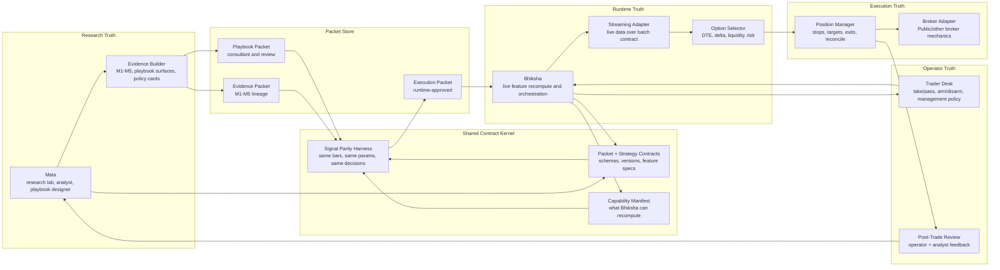

# Mala / Bhiksha Refactor Architecture

Status: proposal draft for review, not an implementation commitment.

## Purpose

This proposal describes how Mala and Bhiksha should look if we had the chance
to refactor them cleanly around the work we have now learned the hard way:

- Mala should remain the research lab, analyst, evidence compiler, and
  playbook-design surface.
- Bhiksha should remain the live runtime, feature recomputation engine, option
  selector, execution manager, and audit logger.
- The bridge between them should not depend on copied feature logic, loose
  strategy names, or trust that a runtime adapter "probably means the same
  thing."

The core refactor is to introduce a small shared contract kernel, make packet
authorization explicit, and make signal-level parity a first-class gate. Feature
extraction should come after parity evidence, not before it.

## North Star

```text
Mala = research lab + analyst + evidence compiler
Bhiksha = live runtime + feature recomputation + option/execution manager
Trader Desk = operator cockpit
Shared Contract Kernel = packet, capability, and parity contracts both must obey
```

The important architectural boundary is not "Mala vs Bhiksha." The durable
boundary is:

```text
Research truth
Runtime truth
Execution truth
Operator truth
Feedback truth
```

Mala and Bhiksha should become applications on top of shared contracts rather
than two systems each carrying their own version of Newton, session semantics,
and strategy interpretation.

## Five Contracts, Four Promotion Gates

The refactor should be argued as contracts between truths, not as a folder
layout question.

```text
Research truth  --[evidence packet]---------------> Operator truth
Operator truth  --[playbook packet / arm decision]-> Runtime truth
Runtime truth   --[execution packet + parity]-----> Execution truth
Execution truth --[fill / fire / outcome events]--> Feedback truth
Feedback truth  --[review artifact]---------------> Research truth
```

The first four crossings are gates that promote or authorize behavior. The last
crossing is the learning loop back into research.

This framing lets us debate each crossing independently:

- what artifact crosses the boundary
- who is allowed to approve it
- what can block it
- what must be recorded afterward

## Target Diagram



## Main Refactor Bet

Create a shared contract kernel used by both Mala and Bhiksha.

The minimum viable kernel should own:

- feature names and feature specs
- packet schemas and versioning
- capability manifest schema
- parity report schema
- parity fixtures and comparison tools

It should not initially own all Newton transforms, calendars, provider
normalization, and strategy implementations. Those are extraction candidates,
not starting assumptions.

This keeps the first move small enough to land cleanly and still attacks the
real problem: unversioned handoff plus unmeasured runtime drift.

## Explicit Bets

Before moving code, the proposal rests on three bets:

- **Bet A: drift is a dominant failure mode.** If wrong Bhiksha fires mostly
  came from Mala/Bhiksha recomputation drift, parity will expose it and shared
  extraction will pay off. If wrong fires mostly came from weak research edges,
  the fix is research quality, not architecture.
- **Bet B: consultation is a durable product.** If the trader keeps using the
  playbook consultant lane as its own workflow, playbook packets are worth
  naming separately. If consultation is just a temporary review state, one
  packet type with states may be simpler.
- **Bet C: Trader Desk is load-bearing.** If the desk gates execution decisions,
  it belongs in the refactor path. If it is only a better viewer, it should
  come after parity and packet authorization.

## Proposed Package Shape

The exact repo layout can be decided later, but conceptually:

```text
mala_bhiksha_kernel/
  contracts/
    packets.py
    strategies.py
    playbooks.py
    capabilities.py
  parity/
    signal_compare.py
    feature_diagnostics.py
    replay_fixture.py
    report_schema.py
```

Then:

```text
mala_v2
  imports shared kernel for packet writing, capability checks, and parity reports

bhiksha
  imports shared kernel for packet validation, capability manifest, and parity reports
```

Later, parity evidence may justify moving specific feature modules into the
kernel:

```text
mala_bhiksha_kernel/
  bars/
  sessions/
  features/
```

But that extraction should happen one strategy family at a time.

## Operational Setup

The implementation should start with isolated work surfaces:

```text
mala_v2 branch:    codex/shared-contract-refactor
bhiksha branch:    codex/shared-contract-refactor
new repo/package:  mala-bhiksha-kernel
```

The first working branch should not change live behavior. It should produce
parity reports against current behavior. Once a family is migrated and proven,
the old duplicated path for that family should be deleted rather than kept as a
parallel wire.

## Packet Types

The refactor should make packet names explicit.

### Evidence Packet

Used by the older M1-M5 lane.

```text
Mala hypothesis
  -> M1-M5 gates
  -> thesis-exit optimization
  -> provider review where relevant
  -> evidence_packet
  -> active_strategy authorization
  -> Bhiksha shadow/live
```

The evidence packet says: "Mala has evidence for this strategy configuration."

It does not say: "Bhiksha has proven runtime parity."

### Playbook Packet

Used by the Mala 2.2 consultant lane.

```text
Mala playbook design
  -> chart/replay consultation
  -> cohort evidence and policy card
  -> playbook_packet
  -> Bhiksha adapter/parity work
```

The playbook packet says: "Here is a reviewable playbook state and management
proposal."

It may remain advisory for a long time.

### Execution Packet

Used only after runtime readiness.

```text
evidence_packet or playbook_packet
  -> feature contract passes
  -> Bhiksha runtime adapter exists
  -> same-bars parity passes
  -> operator approves
  -> execution_packet
```

The execution packet says: "Bhiksha may shadow or trade this under the declared
mode and controls."

## Parity As A Gate

Parity pass/fail should be judged at the signal and decision layer:

```text
same input bars + same params
  -> same signal timestamps/directions
  -> same invalidation timestamps
  -> same thesis-exit decisions where applicable
```

Feature diffs are diagnostics for disagreements. They should explain why a
signal missed or fired extra; they should not be the primary pass/fail
primitive. A tiny feature delta can be harmless far from a threshold and
catastrophic at the threshold.

Parity output should be an artifact, not just a unit-test pass:

```text
artifacts/parity/<packet_id>/<timestamp>/
  signal_diff.csv
  feature_diagnostics.csv
  exit_diff.csv
  PARITY_REPORT.md
```

The report should classify signal disagreements:

- `feature_drift`
- `provider_drift`
- `warmup_drift`
- `session_boundary_drift`
- `strategy_semantic_drift`
- `exit_semantic_drift`

Promotion rule:

- No playbook packet becomes an execution packet until parity passes.
- No M1-M5 strategy gets live promotion if its active packet has unresolved
  parity misses or extra Bhiksha fires.

## Packet Registry

Packet registry is load-bearing because packet id + version should become the
unit of authorization.

Recommended default:

```text
canonical packet body: git-tracked JSON
operator index:        generated Google Sheet row
runtime compile:       Bhiksha reads approved packet id + version
```

Sheets remain the human control tower, but the full packet payload should not
be an editable row blob. The sheet should expose status, owner, approval,
summary, and links. The immutable JSON body should preserve what was actually
approved.

If we are not willing to build the registry, then we should not pretend packet
ids are authoritative. In that fallback world, `active_strategy` remains the
authorization unit and the refactor is smaller.

## Streaming Adapter

The runtime adapter should be named as a streaming adapter, not a vague strategy
adapter.

Batch research assumes completed bars and stable historical windows. Live
runtime deals with partial bars, late ticks, missing volume, provider gaps, and
ordering. The adapter's job is to reconcile live streaming data into the batch
contract that parity tested.

That distinction matters:

- semantic mismatch means the strategy or feature contract is wrong
- streaming mismatch means live data shape differs from historical batch shape
- provider mismatch means the same contract is fed different market data

## Trader Desk

Trader Desk should sit inside or immediately above Bhiksha.

It should not be a research dashboard. It is the operating cockpit.

Critical-path surface:

- arm/disarm
- emergency square-off
- packet status
- current position-state dump
- runtime block reason

Product surface, after parity and authorization are stable:

- current packet card
- take/pass
- management-policy selection
- option contract preview and selection rationale
- portfolio and buying-power context
- stop/target/invalidation state
- GDS-style option health metrics
- post-trade feedback capture

For playbooks, the desk should feel like:

```text
Mala: "Here is the analyst card."
Operator: "Take or pass; choose management policy."
Bhiksha: "Here is the option, risk, and live management plan."
Operator: "Arm."
Bhiksha: "Execute, manage, reconcile, record."
Mala: "Consume the feedback later."
```

## Feedback Loop

Bhiksha should write structured feedback for both lanes:

- packet id and version
- operator decision: pass/take/arm/disarm
- feature snapshot at decision time
- option selected and why
- rejected option candidates and why
- entry fill or missed-entry reason
- stop/target/invalidation events
- realized outcome
- operator notes
- analyst notes
- post-close replay link

Mala should consume this as evidence and review input. Mala should not treat
live feedback as proof by itself; it should turn feedback into future research,
playbook refinement, and packet revisions.

## Migration Plan

### Phase 0: Freeze Vocabulary And Authorization

Decide and document:

- evidence packet
- playbook packet
- execution packet
- active strategy row
- runtime deployment
- Trader Desk
- shared contract kernel
- parity report
- packet id + version as the preferred authorization unit
- canonical packet body vs generated operator index

Deliverable: docs only.

### Phase 1: Parity Harness Before Extraction

Before moving files around, build the comparison tool against the current repos.

Start with the active older strategies:

- Market Impulse
- Opening Drive
- Jerk Pivot
- Elastic Band

Deliverable: a parity report that can say whether old wrong fires were likely
feature drift, provider drift, session drift, strategy drift, or execution drift.

### Phase 2: Minimal Kernel And Registry

Create the small shared contract kernel:

- feature names
- packet schemas
- capability manifest schema
- parity report schema
- replay fixtures

Create the first packet registry path:

- immutable JSON packet body
- generated sheet/index row
- Bhiksha reads approved packet id and version

Deliverable: one packet can be written, indexed, approved, and compiled without
changing live execution behavior.

### Phase 3: Evidence-Based Feature Extraction

Extract only the features parity proves are risky.

Likely first families:

- Market Impulse VMA/VWMA/stage semantics
- session and warmup helpers
- VPOC and directional mass if they explain mismatches

Deliverable: Mala and Bhiksha both import the same implementation for one
drift-proven feature family.

### Phase 4: Hard Cutover Per Family

For each migrated family:

```text
old path remains only until replacement passes
new path becomes default
old duplicated wire is deleted
failures become loud in test and fail-closed in runtime
```

Deliverable: no permanent dual-path confusion.

### Phase 5: Minimal Trader Desk

Build the operator cockpit on top of Bhiksha.

Critical path only:

- arm/disarm
- packet status
- position-state dump
- emergency controls
- runtime block reason

Deliverable: supervised shadow desk before live automation.

### Phase 6: Product Trader Desk And Playbook Automation

Only after the first playbook adapter passes parity, allow the consultant lane
to produce execution packets.

Deliverable: one playbook, one symbol basket, one option policy, one management
menu, shadow first.

## What This Refactor Avoids

- Mala becoming a broker runtime.
- Bhiksha blindly trusting research rows.
- `public_api_trading_v3` becoming a second execution brain.
- duplicated Newton transforms drifting silently.
- playbook consultation being confused with live authorization.
- M1-M5 evidence being confused with runtime parity.

## Open Questions

1. Should the shared kernel live as its own repo, a package inside `mala_v2`, or
   a package inside `openclaw-core`?
2. Should we commit to git-tracked JSON as canonical packet body and Sheets as
   generated operator index?
3. Is Trader Desk architecture-critical or product-after-parity?
4. Should Trader Desk be a Bhiksha-native UI or a separate surface above
   Bhiksha APIs?
5. Which strategy family should be the first parity harness target:
   Market Impulse, Opening Drive, or the new IWM/QQQ mean-reversion playbook?
6. How should streaming-vs-batch mismatch be represented in parity reports?

## Recommendation

Do not start by extracting Newton.

Start by building contracts, packet registry, and signal-level parity against
the current repos. That will tell us which duplicated features are actually
dangerous, which wrong fires were caused by provider/session drift, and which
pieces deserve extraction first.

Then extract shared features with evidence, not assumptions.
